# git常用分支操作
git不要在下代码的主分支上修改代码，要checkout一个开发分支，在上面开发，开发完成后再切换回主分支，
进行衍合或合并操作。最后再在主分支上向远程提交代码。类似的修bug也要在主分支上创建一个分支进行操作，
**永远确保主分支是稳定版。**
# git修改密码
打开git bash
输入 cd ~/.ssh
ls 确定有 id_rsa 和 id_rsa.pub文件
ssh-keygen -p -f id_rsa
第一次输入旧密码
新密码
确认新密码
# git压缩多次提交为一次提交
**切记已经推送到远程版本不可再使用。**
比如压缩最后4次提交为一次提交   
```
git rebase -i HEAD~4
```
该命令执行后，会弹出vim的编辑窗口，4次提交的信息会倒序排列，
最上面的是第四次提交，最下面的是最近一次提交。  
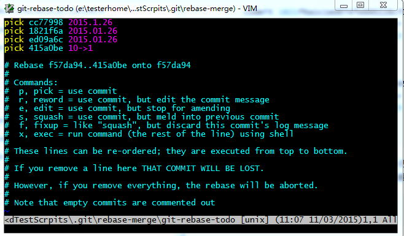  
我们需要修改第2-4行的第一个单词pick为squash，
这个意义为将最后三次的提交压缩到倒数第四次的提交，
效果就是我们在pick所在的提交就已经做了4次动作，但是看起来就是一次而已：  
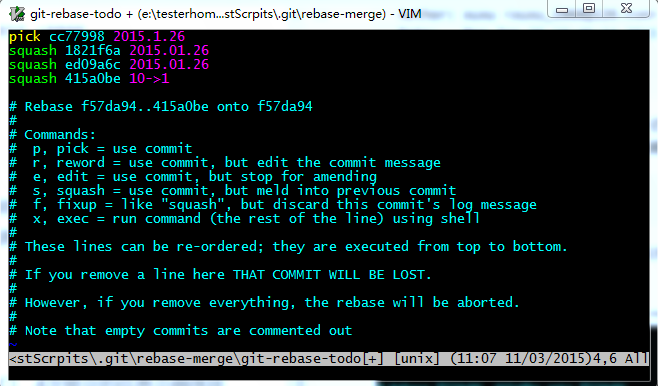  
然后我们保存退出，git会一个一个压缩提交历史，如果有冲突，需要修改，修改的时候要注意，
保留最新的历史，不然我们的修改就丢弃了。修改以后要记得敲下面的命令：
```
git add .
git rebase --continue
```
如果你想放弃这次压缩的话，执行以下命令：
```
git rebase --abort
```
如果所有冲突都已经解决了，会出现如下的编辑窗口：  
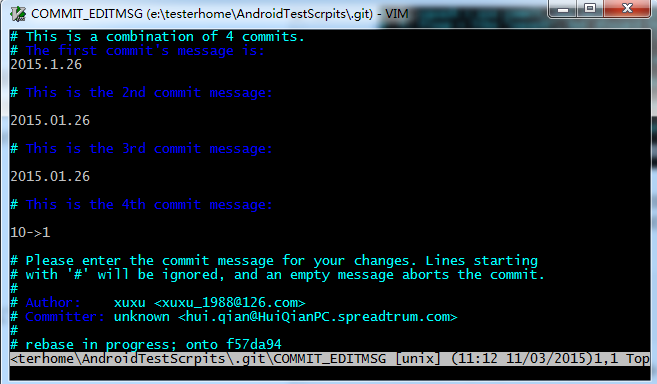  
这个时候我们需要修改一下合并后的commit的描述信息，我们将其描述为helloworld吧：  
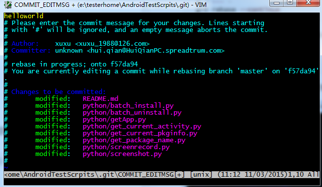  
如果想压缩第一三四次的提交，不压缩第二次的提交，可以移动一下提交顺序。
# 改变两次提交先后顺序
**切记已经推送到远程版本不可再使用。**
方法同上，使用交互式衍合操作，只需要改动图片中的顺序
  
# 拆分提交
**切记已经推送到远程版本不可再使用。**
拆分一个提交会撤消这个提交，然后多次地部分地暂存与提交直到完成你所需次数的提交。 
例如，假设想要拆分三次提交的中间那次提交。 想要将它拆分为两次提交：
第一个 “updated README formatting”，第二个 “added blame” 来代替原来的 
“updated README formatting and added blame”。 可以通过修改 rebase -i 
的脚本来做到这点，将要拆分的提交的指令修改为 “edit”：
```
pick f7f3f6d changed my name a bit
edit 310154e updated README formatting and added blame
pick a5f4a0d added cat-file
```
然后，当脚本将你进入到命令行时，重置那个提交，拿到被重置的修改，从中创建几次提交。 
当保存并退出编辑器时，Git 带你到列表中第一个提交的父提交，
应用第一个提交（f7f3f6d），应用第二个提交（310154e），
然后让你进入命令行。 那里，可以通过 git reset HEAD^ 做一次针对那个提交的混合重置，
实际上将会撤消那次提交并将修改的文件未暂存。 现在可以暂存并提交文件直到有几个提交，
然后当完成时运行 git rebase --continue：
```
$ git reset HEAD^
$ git add README
$ git commit -m 'updated README formatting'
$ git add lib/simplegit.rb
$ git commit -m 'added blame'
$ git rebase --continue
```
Git 在脚本中应用最后一次提交（a5f4a0d），历史记录看起来像这样：
```
$ git log -4 --pretty=format:"%h %s"
1c002dd added cat-file
9b29157 added blame
35cfb2b updated README formatting
f3cc40e changed my name a bit
```
再一次，这些改动了所有在列表中的提交的 SHA-1 校验和，
所以要确保列表中的提交还没有推送到共享仓库中。
# 修改最后一次提交
**切记已经推送到远程版本不可再使用。**
如果你已经完成提交，又因为之前提交时忘记添加一个新创建的文件，想通过添加或修改文件来更改提交的快照，
也可以通过类似的操作来完成。 通过修改文件然后运行 git add 或 git rm 一个已追踪的文件，
随后运行 git commit --amend 拿走当前的暂存区域并使其做为新提交的快照。
使用这个技巧的时候需要小心，因为修正会改变提交的 SHA-1 校验和。 
它类似于一个小的衍合 - 如果已经推送了最后一次提交就不要修正它。
##Stash未提交的更改
你正在修改某个bug或者某个特性，又突然被要求展示你的工作。而你现在所做的工作还不足以提交，这个阶段你还无法进行展示（不能回到更改之前）。在这种情况下， git stash可以帮助你。
stash在本质上会取走所有的变更并存储它们为以备将来使用。stash你的变更，你只需简单地运行下面的命令-  
```
git stash
```
希望检查stash列表，你可以运行下面的命令：  
```
git stash list
```
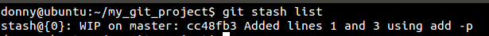  
如果你想要解除stash并且恢复未提交的变更，你可以进行apply stash:  
```
git stash apply
```
在屏幕截图中，你可以看到每个stash都有一个标识符，一个唯一的号码（尽管在这种情况下我们只有一个stash）。
如果你只想留有余地进行apply stash，你应该给apply添加特定的标识符：
```
git stash apply stash@{2}
```
丢弃stash区的内容  
```
git stash drop
```
如果想应用stash同时丢弃
```
git stash pop
```
就相当于先执行git stash apply 再执行 git stash drop  
#  暂存文件的部分改动
一般情况下，创建一个基于特性的提交是比较好的做法
，意思是每次提交都必须代表一个新特性的产生或者是一个bug的修复。
如果你修复了两个bug，或是添加了多个新特性但是却没有提交这些变化会怎样呢？
在这种情况下，你可以把这些变化放在一次提交中。但更好的方法是把文件暂存(Stage)然后分别提交。
例如你对一个文件进行了多次修改并且想把他们分别提交。这种情况下，你可以在 add 命令中加上 -p 参数
```
git add -p [file_name]
```
我们来演示一下在 file_name 文件中添加了3行文字，但只想提交第一行和第三行。先看一下 git diff 显示的结果：    
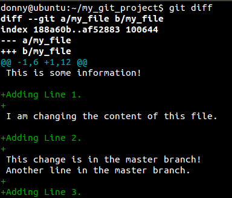  
然后再看看在 add 命令中添加 -p 参数是怎样的？  
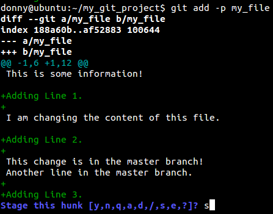  
看上去，Git 假定所有的改变都是针对同一件事情的，因此它把这些都放在了一个块里。你有如下几个选项：

- 输入 y 来暂存该块

- 输入 n 不暂存

- 输入 e 手工编辑该块

- 输入 d 退出或者转到下一个文件

- 输入 s 来分割该块  


在我们这个例子中，最终是希望分割成更小的部分，然后有选择的添加或者忽略其中一部分。  

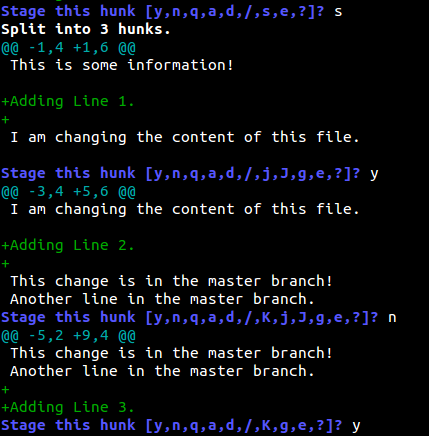  
正如你所看到的，我们添加了第一行和第三行而忽略了第二行。之后你可以查看仓库状态之后并进行提交。  
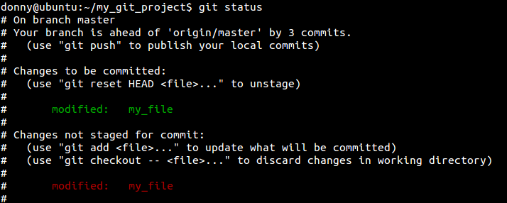  

# Cherry Pick
我把最优雅的Git命令留到了最后。cherry-pick命令是我目前为止最喜欢的git命令，
既是因为它的字面意思，也因为它的功能。

简而言之，cherry-pick就是从不同的分支中捡出一个单独的commit，
并把它和你当前的分支合并。如果你以并行方式在处理两个或以上分支，
你可能会发现一个在全部分支中都有的bug。如果你在一个分支中解决了它，
你可以使用cherry-pick命令把它commit到其它分支上去，而不会弄乱其他的文件或commit。

让我们来设想一个用得着它的场景。我现在有两个分支，并且我想cherry-pick b20fd14:
Cleaned junk 这个commit到另一个上面去。  
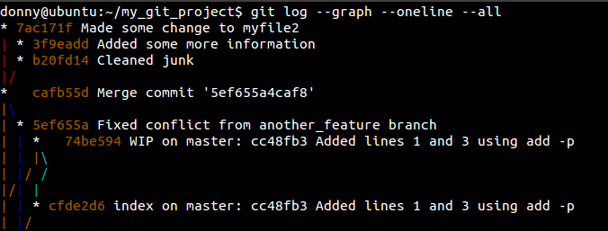  
我切换到想被cherry-pick应用到的这个分支上去，然后运行了如下命令：
```
git cherry-pick [commit_hash]
```
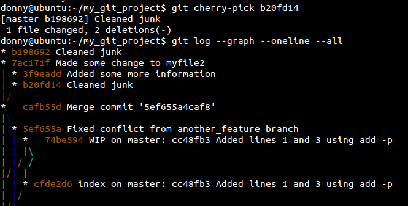
#git操作远程分支
### 查看远程分支
```
$git branch -r
```
### 查看所有远程和本地分支
```
$git branch -a
```
### 新增远程分支
```
$git branch dev  // 先在本地创建分支
$git push origin dev //再推送到远程
```
### 删除远程分支和tag
在Git v1.7.0 之后，可以使用这种语法删除远程分支：
```
$ git push origin --delete <branchName>
```
删除tag这么用：
```
git push origin --delete tag <tagname>
```
否则，可以使用这种语法，推送一个空分支到远程分支，其实就相当于删除远程分支：
```
git push origin :<branchName>
```
这是删除tag的方法，推送一个空tag到远程tag：
```
git tag -d <tagname>
git push origin :refs/tags/<tagname>
```
两种语法作用完全相同。
### 删除不存在对应远程分支的本地分支

假设这样一种情况：  

我创建了本地分支b1并pull到远程分支 origin/b1；  
其他人在本地使用fetch或pull创建了本地的b1分支；  
我删除了 origin/b1 远程分支；  
其他人再次执行fetch或者pull并不会删除这个他们本地的 b1 分支，运行 git branch -a 也不能看出这个branch被删除了，如何处理？  
使用下面的代码查看b1的状态：  
```
$ git remote show origin
* remote origin
  Fetch URL: git@github.com:xxx/xxx.git
  Push  URL: git@github.com:xxx/xxx.git
  HEAD branch: master
  Remote branches:
    master                 tracked
    refs/remotes/origin/b1 stale (use 'git remote prune' to remove)
  Local branch configured for 'git pull':
    master merges with remote master
  Local ref configured for 'git push':
    master pushes to master (up to date)
```
这时候能够看到b1是stale的，使用 git remote prune origin 可以将其从本地版本库中去除。  
更简单的方法是使用这个命令，它在fetch之后删除掉没有与远程分支对应的本地分支：  
```
git fetch -p
```
重命名本地分支：
```
git branch -m devel develop
```
推送本地分支：
```
$ git push origin develop
Counting objects: 92, done.
Delta compression using up to 4 threads.
Compressing objects: 100% (48/48), done.
Writing objects: 100% (58/58), 1.38 MiB, done.
Total 58 (delta 34), reused 12 (delta 5)
To git@github.com:zrong/quick-cocos2d-x.git
 * [new branch]      develop -> develop
 ```
 把本地tag推送到远程
```
git push --tags
```
获取远程tag
```
git fetch origin tag <tagname>
```
#git tag — 标签相关操作
标签可以针对某一时间点的版本做标记，常用于版本发布。  

列出标签  
```
$ Git tag # 在控制台打印出当前仓库的所有标签
$ git tag -l ‘v0.1.*’ # 搜索符合模式的标签
```
打标签   
git标签分为两种类型：轻量标签和附注标签。轻量标签是指向提交对象的引用，附注标签则是仓库中的一个独立对象。建议使用附注标签。  
### 创建轻量标签
```
$ git tag v0.1.2-light
```
### 创建附注标签
```
$ git tag -a v0.1.2 -m “0.1.2版本”
```
创建轻量标签不需要传递参数，直接指定标签名称即可。
创建附注标签时，参数a即annotated的缩写，指定标签类型，后附标签名。参数m指定标签说明，说明信息会保存在标签对象中。

切换到标签
与切换分支命令相同，用git checkout [tagname]
查看标签信息
用git show命令可以查看标签的版本信息：
```
$ git show v0.1.2
```
删除标签
误打或需要修改标签时，需要先将标签删除，再打新标签。
```
$ git tag -d v0.1.2 # 删除标签
```
参数d即delete的缩写，意为删除其后指定的标签。

给指定的commit打标签
打标签不必要在head之上，也可在之前的版本上打，这需要你知道某个提交对象的校验和（通过git log获取）。
### 补打标签
```
$ git tag -a v0.1.1 9fbc3d0
```
标签发布
通常的git push不会将标签对象提交到git服务器，我们需要进行显式的操作：
```
$ git push origin v0.1.2 # 将v0.1.2标签提交到git服务器
$ git push origin –tags # 将本地所有标签一次性提交到git服务器
```
 

注意：如果想看之前某个标签状态下的文件，可以这样操作
```
1.git tag   查看当前分支下的标签

2.git  checkout v0.21   此时会指向打v0.21标签时的代码状态，（但现在处于一个空的分支上）

3. cat  test.txt   查看某个文件
```
