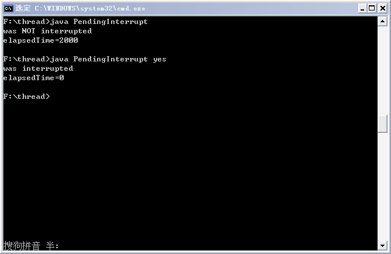
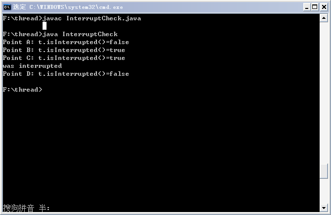
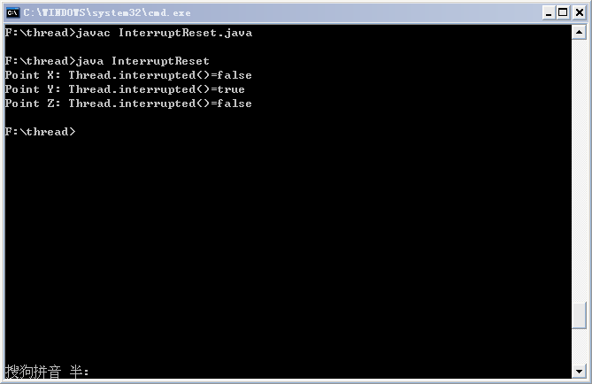
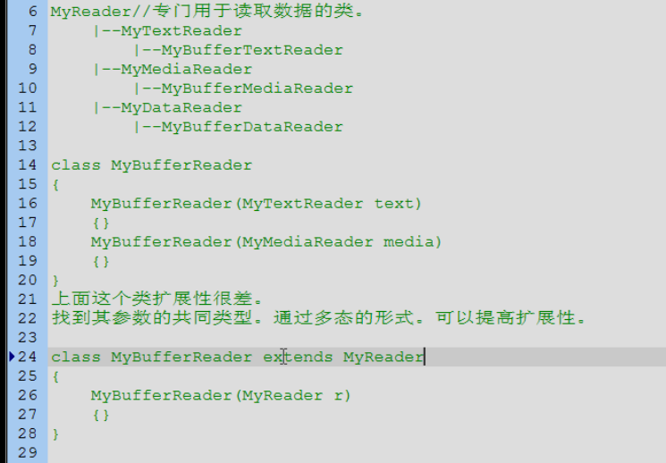
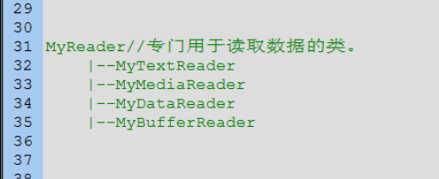
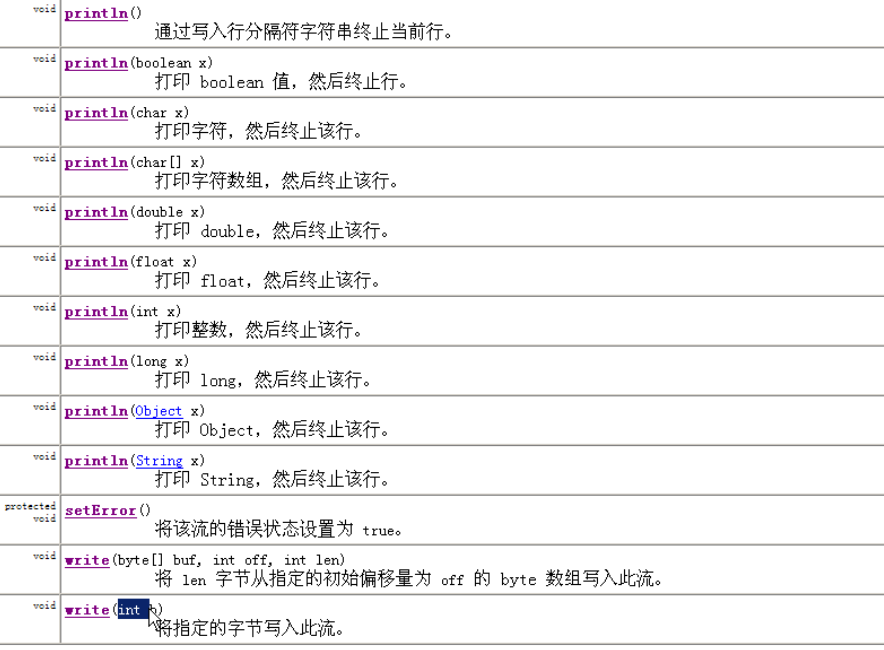
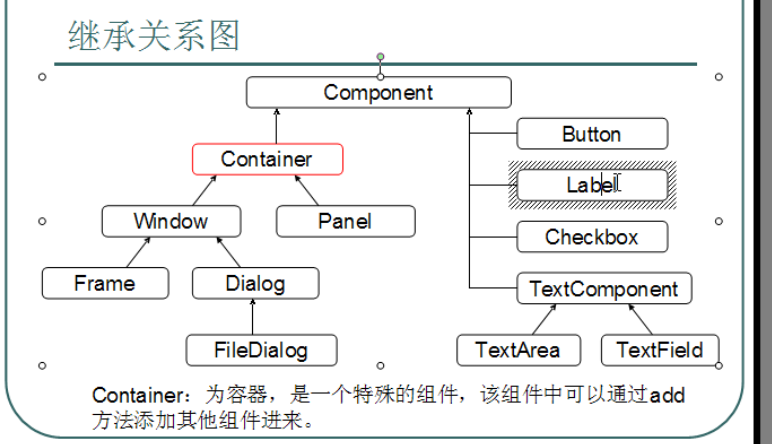
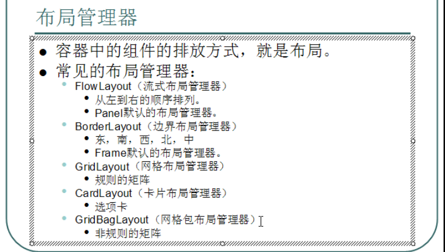
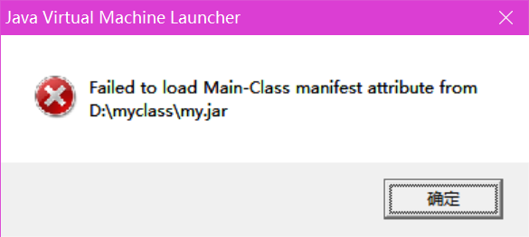

## Java 反射之私有字段和方法详细介绍
尽管我们通常认为通过JAVA的反射机制来访问其它类的私有字段和私有方法是可行的，其实并没有那么困难。   
注释：只有在单独的JAVA程序中运行该代码才有效，就像你做一些单元测试或者常规的程序。如果你尝试在JAVA APPLET内使用该方法，你需要稍稍修改SecurityManager。但是，因为你不是经常需要与它打交道，这里也就不再赘述了。   
这里是本次内容的列表:   
1.访问私有字段。   
2.访问私有方法。   
访问私有字段:   
为了访问私有字段，你需要调用```Class.getDeclaredField(String name)```或者```Class.getDeclaredFields()```方法。方法```Class.getField(String name)```和```Class.getFields()```仅仅返回共公开的字段，所以它们都无法起到作用。这里有一个例子，该例子中有一个包含私有字段的类，在该类下面有通过反射访问私有字段的代码。   
复制代码 代码如下:
```java
public class PrivateObject { 
private String privateString = null; //声明为私有字段 
public PrivateObject(String privateString) { 
    this.privateString = privateString; 
} 
} 
```
复制代码 代码如下:
```java
PrivateObject privateObject = new PrivateObject("The Private Value");//实例化对象 
Field privateStringField = PrivateObject.class. 
getDeclaredField("privateString"); 
privateStringField.setAccessible(true);//允许访问私有字段 
String fieldValue = (String) privateStringField.get(privateObject);//获得私有字段值 
System.out.println("fieldValue = " + fieldValue); 
```
这个代码会打印出文本```"fieldValue = The Private Value"```，而该值正好是对象```PrivateObject```的私有字段```privateString```的值。 
注意到我们使用了方法```PrivateObject.class.getDeclaredfield("privateString")```。正是这个调用这个方法返回了私有字段。这个方法仅仅根据指定的类返回字段，不会返回父类声明的字段。 
另外仔细观察加粗的语句。通过调用 ```Field.setAccessible(true)```，你关掉了对于这个指定字段实例的访问检查，仅仅对反射有效。现在你能访问它了，不管它是私有的，保护的或是默认的(default)，即时调用者并不在该范围中。你仍然不能通过常规方法访问该字段，因为编译器不允许。 
访问私有方法 
为了访问一个私有方法，你需要调用```Class.getDeclaredMethod(String name,Class[] parameterTypes)```或者```Class.getDeclaredMethods()```方法。方法```Class.getMethod(String name,Class[] parameterTypes)```和```class.getMethods()```仅仅返回公有方法，所以它们不会起到作用。下面是一个简单的例子，该例子中有一个拥有私有方法的类，类下面是通过反射机制访问私有方法的代码。 
复制代码 代码如下:
```java
public class PrivateObject { 
private String privateString = null; 
public PrivateObject(String privateString) { 
    this.privateString = privateString; 
} 
private String getPrivateString(){//私有方法 
    return this.privateString; 
} 
} 
```
复制代码 代码如下:
```java
PrivateObject privateObject = new PrivateObject("The Private Value"); 
Method privateStringMethod = PrivateObject.class. 
getDeclaredMethod("getPrivateString", null); 
privateStringMethod.setAccessible(true); 
String returnValue = (String)privateStringMethod.invoke(privateObject, null); 
System.out.println("returnValue = " + returnValue); 
```
这个代码例子会打印出文本```"returnValue = The private Value"```，该值正好是私有方法的返回值。

转自 [http://www.jb51.net/article/32170.htm](http://www.jb51.net/article/32170.htm)
## 由```ibatis```中的逆向工程的bug引起空指针异常的血案：操作符优先级问题
工作中同事采用ibatis的逆向工程根据数据库表生成了java代码，model、dao、sqlmap这些东西。其中的model层复写的equals方法是这样的
``` java
public boolean equals(User user1,User user2){
    return user1.getUserName() == null ? false : user1.getUserName().equals(user2.getUserName())
    && user1.getPassword() == null ? false: user1.getPassword.equals(user2.getPassword)
    && user1.getGender() == null ? false: user1.getGender().equals(user2.getGender())
}
```
bug在哪里呢？那我们看下面的例子
``` java
return true? false: true
    && true? false:true
```
这句我们可能认为```true?false:true```返回的是```false```然后```false&&```无论什么都是```false```，所以最终结果返回```false```,但实际返回的是```true```。  
怎么回事呢？事实上```&&```的优先级要比三目运算符```xx?xx:xx```要高，所以实际运算顺序是```true?false:true```这一步返回的是```false```，然后```false && xx```，这时候```user1.getUserName==null```根本没有进行判断而结果是```false```,然后是```false?false:true```,所以最好返回结果是```true```。   
于是乎引发了这个血案，就是```user1.getName==null```是正确的所以是```false```，这时候```user1.getPassword()==null```没有进行判断就走到了```user1.getPassword.equals(user2.getPassword())```，而导致了空指针异常```NullPointerException```
## ```ArrayList```的默认值是多少，怎样扩容
1.6是默认值是```10```，见```ArrayList```类的```ArrayList()```方法中有```this(10)```。扩容方法是原数组满了之后加上原来长度的一半加1，见```ArrayList()```的```ensureCapacity(int minCapacity)```方法。```int newCapacity = (oldCapacity * 3) / 2 + 1```;同时创建一个新的```newCapacity```长度的数组讲原来的数组迁移到新数组在放弃原数组。  
1.7是初始值是```0```，然后```add```的时候改成默认值```10```，增长见```grow(int minCapacity)```方法```int newCapacity = oldCapacity + (oldCapacity >> 1);if (newCapacity - minCapacity < 0)newCapacity = minCapacity;```所以是当数组满了之后增长为原来的3/2，也就是```oldCapacity + (oldCapacity >> 1)```  
```Vector``` 是jdk1.1就有的，那时候还没有集合框架，集合框架是jdk1.2诞生的，```Vector``` 线程安全操作慢，```ArrayList``` 线程不安全操作快，而且```Vector``` 满了之后扩增一倍，浪费空间。
## ```HashMap```的默认值是多少，怎样扩容
```hashMap```的默认值是```16```.见```HashMap```类的```HashMap()```方法中```table = new Entry[DEFAULT_INITIAL_CAPACITY]```，而此常量值为16.扩容是长度乘以2.见```addEntry(int hash,K key,V value,int bucketIndex)```方法。里面有```resize(2 * table.length)```但是不是满了就扩容。而是达到原长度乘以扩容因子的乘积之后扩容。见```addEntry```方法中的```if(size++ >= threshold) resize(2 * table.length)```。而```threshold```的值是```DEFAULT_INITIAL_CAPACITY*DEFAULT_LOAD_FACTOR```。扩容因子的值是```0.75```。
## 子类集成父类的属性。修改了父类属性的类型导致运行时子类报```NoSuchFieldException```
由于之前父类的这个属性是一个```Service```，在开事务的情况下，注入属性的时候写实体类的```ServiceImpl```类型会切不到事务，所以改bug讲这个属性类型改为了```Service```接口类型来注入。而子类中引用了这个属性，调用这个```service```上的```add```方法，综合环境报了```NoSuchFieldException```异常。原因是综合功能环境是采用的```class```文件增量更新。父类修改了导致重新编译了```class```。本地环境是全部编译，所以子类没有修改内容也重新编译了，所以没有报错。然后综合环境是```class```文件替换，如果子类没有修改过就不会替换```class```。而子类编译```class```的时候如果有引用父类的变量在编译的时候就会将对父类的引用转换为子类中的变量。而没有重新编译所以综合环境上子类还是持有的原来父类的引用。由此引申到如果定义一个```static final int age=1```的话，其他的类使用了这个```final```属性的引用的话，编译的时候会将这个引用替换为常量的值。所以反编译```class```的时候这时将没有这个常量的引用，而只有```1```。
## ```AtomicLong```、```AtomicInteger```在高并发的情况下可以保证线程安全而```long```不可以。
高并发的情况下```long i```的```i++```这种跟原来的值有关系的赋值操作可能会出错，而使用```AtomicLong```就可以了。他的底层使用的不是乐观锁也不是悲观锁，而是```Cas锁```，就是```copyandswap```算法的锁，是一种无锁算法。采用的是```c```语言写的。用```native```修饰的方法。而```c```语言的代码是直接控制了cpu在执行这个属性简单的赋值操作的时候不允许cpu切换到别的线程干别的事情，是c语言直接控制了cpu。
## ```ThreadLocal```中的```get()```的时候可能会引起空指针问题
由于```ThreadLocal```中的```set()```和```get()```方法都是操作的内部的叫做```threadLocalmap```的属性。这个属性以```ThreadLocal```类型的```this```对象为键以传入的```Object```类型的变量为值。但是这个```ThreadLocal```类型的```this```对象采用的是虚引用```WeakedReference```，所以在```gc```的时候就被回收了导致键没有了，导致```get()```空指针，而且出现了内存泄漏（键被gc了，值还存在，值不可达）。所以jdk采用的办法是在下一次调用```get()set()remove()```方法的时候会检查有没有内存泄漏的，有的话就清除一下。而jdk采用虚引用作为键官方解释是说为了防止时间长有大的对象被```ThreadLocalmap```长期占用，导致内存溢出。而为了防止空指针，可以采取的办法是在工具类里面设置静态的```ThreadLocal```对象```=new TheadLocal()```作为强引用。由于是静态变量，直到程序结束，才会被回收，（静态变量随着类的加载而加载，随着类的消失而消失）这样就可以不检查```get()```是否返回空指针。
举例
```java
//退款需要操作的库存
private static ThreadLocal<List<ProdStorage>> refundSuncessProdStorageHolder = new ThreadLocal<List<ProdStorage>>(){
    @Override
    protected List<ProdStorage> initialValue(){
        return new ArrayList<ProdStorage>();
    }
}
//商户是否使用redis存储库存
private static ThreadLocal<Map<String,Boolean>> redisSupportHolder = new ThreadLocal<Map<String,Boolean>>(){
    @Override
    protected Map<String,Boolean> initialValue(){
        return new HashMap<String,Boolean>();
    }
}
public static ThreadLocal<List<ProdStorage>> getRefundSuccessProdStorageHolder(){
    return refundSuncessProdStorageHolder;
}
public static ThreadLocal<Map<String,Boolean>> getRedisSupportHolder(){
    return redisSupportHolder;
}
```
另外的问题是当线程创建的时候把当前线程作为key，如果线程被销毁，则这个```ThreadLocal```被销毁，但是在使用线程池的时候，线程永生，可能会导致没有set值的时候调用get方法会返回上一次线程使用的值，所以应该在线程不用之前手动调用```remove()```方法。
## ```java```中的四种引用类型
按照从强到弱顺序是强引用，软引用，弱引用，虚引用。```强引用```是我们在编程过程中使用的最简单的引用，如代码```String s="abc"```中变量```s```就是字符串对象```"abc"```的一个强引用。任何被强引用指向的对象都不能被垃圾回收器回收，这些对象都是在程序中需要的。而```软引用```是在内存快要溢出之前会被gc掉，常用于缓存的场景。而```弱引用```会在任意次gc的时候，不一定内存要溢出的时候被gc掉，常用于性能优化为目的的缓存而不是为了防止内存溢出。```虚引用```是影子引用，用的很少。
## ```Person p = new Person("zhangsan",20)``` 这句话都做了什么事情？
1.因为new用到了```Person.class```,所以会先找到```Person.class```文件并加载到内存（方法区）中。  
2.执行该类的```static```代码块，如果有的话，给```Person.class```类进行初始化（先将类代码静态内容放入静态方法区，再将类中非静态方法加入非静态方法区）。  
3.在堆内存开辟内存空间，分配内存地址。  
4.在堆内存中建立对象的特有属性，并进行```默认初始化```。（赋予安全值0，null等）  
5.对属性进行显示初始化（```实例变量初始化器```）  
6.对该对象进行构造代码块初始化。（```实例初始化器```）
7.对对象进行```构造函数初始化```。  
7.将内存地址付给栈内存中的p变量。
## ```p.setName("lisi")```这句话又做了什么？
过程.png)
如上图所示，从上面的7步继续，栈内存中原来有```main```方法，现在有引用```p```(指向堆内存中对象的地址0x0023），方法```setName```，```name```变量和```this```。```p```调用```setName```方法，这时候```p```就是```this```，所以将```p```的地址0x0023赋值给```this```，而```this```调用```setName```所以找到堆内存中的```setName```方法，讲堆内存中的name赋值为lisi，而再次调用```P p1 = new P1();p1.setName("qq");```时也是在栈内存产生引用```p```,```name```,```this```,方法```setName```，先给```this```赋值为```p```的地址，然后通过```this```找到堆内存中的对象，再将堆内存中的```name```赋值修改。
## 单例模式中的懒汉模式和饿汉模式
### 饿汉模式：先初始化对象
``` java
class Single{
    private Single(){};
    private static final Single s = new Single();
    public static Single getInstance(){
        return s;
    }
}
```
### 懒汉模式：对象方法被调用时再初始化，延时加载。
``` java
class Single{
    private Single(){};
    private static Single s = null;
    public static Single getInstance(){
        if(s == null){
            synchronized(Single.class){
                if(s == null){
                    s = new Single();
                }
            }
        }
        return s;
        
    }
}
```
两次判断，外层判断是为了已经有了对象不再去拿锁提高效率，内层判断是为了防止多线程并发出现错误，有可能在外层判断加锁之前程序切换。另外懒汉模式中锁是类的字节码对象因为此方法是静态方法。
## 多态总结
### 1.多态的体现
父类的引用指向了自己的子类对象。  
父类的引用也可以接收自己的子类对象。
### 2.多态的前提
必须是类与类之间有关系，要么继承，要么实现。  
通常还有一个前提：存在覆盖。
### 3.多态的好处
大大提高了程序的扩展性
### 4.多态的弊端
虽然提高了程序的扩展性，但是只能使用父类引用中的父类成员。
### 5.在多态中成员函数的特点
在编译期间，参阅引用型变量所属的类是否有调用的方法，如果有，编译通过，如果没有编译失败。  
在运行期间，参阅对象所属的类中是否有调用的方法。  
简单总结就是：成员函数在多态调用时，编译看左边，运行看右边。（动态绑定）
### 6.在多态中成员变量的特点
无论编译还是运行，都参考左边（引用型变量所属的类）。
### 7.在多态中，静态成员函数的特点：
无论编译还是运行，都参考左边。（静态绑定）
## 内部类的访问规则
1.内部类可以访问外部类中的成员，包括私有。  
之所以可以直接访问外部类中的成员，是因为内部类持有了一个外部类的引用。格式 ```外部类名.this  ```
2.外部类要访问内部类，必须建立内部类对象。  
## 内部类的访问格式
1.当内部类定义在外部类的成员位置上，而且非私有，可以在外部其他类中可以直接访问内部类对象。  
格式：  
外部类名.内部类名 变量名 = 外部类对象.内部类对象  
```java
Outer.Inner in = new Outer().new Inner();  
```
2.当内部类在外部类的成员位置上时，就可以被成员修饰符所修饰。比如  
private:将内部类在外部类中进行封装。  
static：讲内部类变成静态内部类。
当内部类被静态修饰时，只能访问外部的静态成员。  
在外部其他类中，如何直接访问静态内部类的非静态成员呢？  
```java
new Outer.Inner().function();  
```
在外部其他类中，如何直接访问static内部类的静态成员呢？ 
``` java
Outer.Inner.function();  
```
注意：当内部类中定义了静态成员，该内部类必须是静态内部类。  
当外部类中的静态方法访问内部类时，内部类也必须是静态内部类。  
3.当内部类定义在局部时  
1）不可以b被成员修饰符修饰  
2）可以直接访问外部类中的成员，因为还持有外部类的引用。但是不可以访问它在局部定义的变量,只能访问被final修饰的局部变量。
## 如何给javac设置编译后class文件的存放位置，如何运行别的位置处的class文件？
```java
javac -d c:\myclass   packa.DemoA.java
```
就会将编译后的class文件存放到制定目录下。  
在当前目录下运行```c:\myclass```下的class文件
```java
set classpath=c:\myclass
java packa.DemoA
```
## 多线程的运行出现安全问题的原因和解决办法
### 原因：
多条语句在操作同一线程共享数据时，一个线程对多条语句只执行了一部分，还没有执行完，另一个线程进来执行，导致共享数据的错误。
### 解决办法：
对多条操作共享数据的语句，只能有一个线程执行完，在执行过程中其他线程不可以参与执行。
## 多线程中方法的锁是什么？
非静态方法的锁是this，静态方法的锁是类的字节码文件。同步的关键是锁必须是同一个锁才能同步。
## 写一个死锁Demo
<a href="example/DeadLockTest.java">死锁示例</a>
## ```wait()、notify()、notifyAll()```的使用场景，为什么定义在Object中?

```wait()、notify()、notifyAll()```都是用在同步中，因为要对持有监视器（锁）的线程操作，  所以要使用在同步中，因为只有同步才具有锁。  
为什么这些操作线程的方法要定义在```Object```中呢？  
因为这些方法在操作线程的同时，都必须标识他们所操作的线程持有的锁，只有同一锁上的被等待线程，可以被同一锁上的```notify```唤醒。不可以对不同锁中的线程进行唤醒。  
也就是说，等待和唤醒必须是同一个锁。  
而锁可以使任意对象，所以可以被任意对象调用的方法定义在```object```中。
## 生产者、消费者模型在多线程模式下为什么需要用```while```判断标记，为什么定义 ```notifyAll```？
使用```while```原因：让被唤醒的线程再一次判断标记。  
使用```notifyAll```原因：因为只用```notify```，容易出现只唤醒本方线程的情况，导致程序中所有的线程被等待。  
代码示例：<a href="example/ProducerConsumerDemo.java" target="_blank">生产者消费者代码示例</a>  
jdk1.5中提供了多线程的升级解决方案。  
讲同步```syncronized```替换成为显式的```Lock```操作。  
将```Object```中的```wait、notify、notifyAll```替换成了```Condition```对象。该对象可以通过```Lock```锁进行获取。该示例中，实现了本方只唤醒对方操作。  
代码示例：<a href="example/ProducerConsumerDemo2.java" target="_blank">生产者消费者代码示例5.0升级版</a>
## 如何停止一个线程？
```stop()``` 方法由于安全问题已经过时。  
如何停止线程？  
只有一种，```run()```方法结束。  
开启多线程运行，运行代码通常是循环结构。  
只要控制住循环，就可以让```run()```方法结束，也就是线程结束。  
特殊情况：  
当线程处于冻结状态(```wait()或者sleep()```)，就不会读取到标记，那么线程就不会结束。  
当没有指定的方式让冻结的线程恢复到运行状态时，这时需要对冻结进行清除。  
强制让线程恢复到运行状态中来，这样就可以操作标记让线程结束。  
```Thread``` 类提供了该方法```interrupt()```；相当于拍了睡的人一砖头，虽然醒了但是受伤了，产生了异常```InterruptedException```  
```interrupt()```方法如果在```sleep()```之前被调用，则线程执行到```sleep()```时就会马上产出```InterruptedException```，此情此景叫做 决断中断。 
示 例：  
```java
public class PendingInterrupt extends Object {  
    public static void main(String[] args){  
        //如果输入了参数，则在main线程中中断当前线程（亦即main线程）  
        if( args.length > 0 ){  
            Thread.currentThread().interrupt();  
        }   
        //获取当前时间  
        long startTime = System.currentTimeMillis();  
        try{  
            Thread.sleep(2000);  
            System.out.println("was NOT interrupted");  
        }catch(InterruptedException x){  
            System.out.println("was interrupted");  
        }  
        //计算中间代码执行的时间  
        System.out.println("elapsedTime=" + ( System.currentTimeMillis() - startTime));  
    }  
}
```
执行结果  

## 使用 isInterrupted()方法判断中断状态
可以在 ```Thread``` 对象上调用 ```isInterrupted()```方法来检查任何线程的中断状态。这里需要注意：线程一旦被中断，```isInterrupted()```方法便会返回 true，而一旦 ```sleep()```方法抛出异常，它将清空中断标志，此时```isInterrupted()```方法将返回 ```false```。
下面的代码演示了 isInterrupted()方法的使用：
```java
public class InterruptCheck extends Object{  
    public static void main(String[] args){  
        Thread t = Thread.currentThread();  
        System.out.println("Point A: t.isInterrupted()=" + t.isInterrupted());  
        //待决中断，中断自身  
        t.interrupt();  
        System.out.println("Point B: t.isInterrupted()=" + t.isInterrupted());  
        System.out.println("Point C: t.isInterrupted()=" + t.isInterrupted());  

        try{  
            Thread.sleep(2000);  
            System.out.println("was NOT interrupted");  
        }catch( InterruptedException x){  
            System.out.println("was interrupted");  
        }  
        //抛出异常后，会清除中断标志，这里会返回false  
        System.out.println("Point D: t.isInterrupted()=" + t.isInterrupted());  
    }  
}  
```
运行结果如下：  

## 使用 Thread.interrupted()方法判断中断状态
可以使用 ```Thread.interrupted()```方法来检查当前线程的中断状态（并隐式重置为 ```false```）。又由于它是静态方法，因此不能在特定的线程上使用，而只能报告调用它的线程的中断状态，如果线程被中断，而且中断状态尚不清楚，那么，这个方法返回 ```true```。与 ```isInterrupted()```不同，它将自动重置中断状态为 ```false```，第二次调用 ```Thread.interrupted()```方法，总是返回 ```false```，除非中断了线程。
如下代码演示了 Thread.interrupted()方法的使用：  
```java
public class InterruptReset extends Object {  
    public static void main(String[] args) {  
        System.out.println(  
            "Point X: Thread.interrupted()=" + Thread.interrupted());  
        Thread.currentThread().interrupt();  
        System.out.println(  
            "Point Y: Thread.interrupted()=" + Thread.interrupted());  
        System.out.println(  
            "Point Z: Thread.interrupted()=" + Thread.interrupted());  
    }  
}
```
运行结果如下：  

## 守护线程介绍
```setDaemon(true)``` 将线程可以设置为守护线程（后台线程），当正在运行的线程都是守护线程时，java虚拟机退出。该方法必须在```start```方法之前被调用。这个方法可使得守护线程不中断而自动结束，就像是圣斗士星矢哥五个守护雅典娜，雅典娜挂了哥五个就失业了。
## ```join``` 方法介绍
当A线程执行到了B线程的```join()```方法时，A线程就会等待。等B线程都执行完，A才会执行。  
```join``` 方法可以临时加入线程执行。
## ```String s1 = "abc" ```与 ```String s2 = new String("abc") ```有什么区别？
就一个区别，s1在内存中有一个对象，s2在内存中有两个对象，分别是abc和new的对象。
## 获取两个字符串中最大的相同子串,```String s1="abcwerthelloyuiodef",s2="cvhellobnm";```
思路：  
1.将短的子串按照长度递减的方式获取到  
2.将获取到的子串去长串中判断是否包含，如果包含，已经找到。
代码实现：
```java
public String getMaxSubString(String s1,String s2){
    String max = "",min = "";
    max = (s1.length() > s2.length()) ? s1 : s2;
    min = (max==s1) ? s2 : s1;
    for(int x=0; x<min.length(); x++){
        for(int y=0,z=min.length()-x; z!=min.length()+1; y++,z++){
            String temp = min.substring(y,z);
            if(max.contains(temp)){
                return temp;
            }
        }
    }
    return "";
}
```
## 集合框架中迭代器的注意事项
迭代器```Iterator```是一个接口，所有集合框架类里面都有```iterator()```方法（实现的```Collection```接口中的方法），该方法返回各自集合类中定义的迭代器内部类。
```List``` 集合特有的迭代器,```ListIterator``` 是```Iterator``` 的子接口。  
在迭代时，不可以通过集合对象中的方法操作集合中的元素。因为会发生```ConcurrentModificationException```异常。所以,在迭代器时，只能用迭代器的方法操作元素，可是```Iterator```方法是有限的,只能对元素进行判断、取出、删除操作。如果想要其他的操作，如增加、修改等，就要使用其子接口```ListIterator```，该接口中的方法除了```hasNext();next();remove();```之外，还有```hasPrevious();previous();set()```等方法。该接口只能通过```List```集合的```listIterator()```方法获取。  
```Vector``` 有一个方法```Enumeration en = v.elements()```,枚举是```Vector``` 特有的取出方式。发现枚举和迭代器很像，其实枚举和迭代器是一样的。因为枚举的名称以及方法的名称都过长，所以枚举被迭代器取代了，枚举郁郁而终了。
## ```linkedList```中的特有方法
```java
void addFirst();
void addLast();
```
```java
E getFirst();
E getLast();
```
获取元素，但不删除元素。如果集合中没有元素，会出现```NoSuchElementExption```
```java
E removeFirst();
E removeLast();
```
获取元素，但是元素被删除。如果集合中没有元素，会出现```NoSuchElementExption``` ，可以用来实现堆栈和队列数据结构。  
但是在jdk1.6之后出现了替代方法
```java
boolean offerFirst();
boolean offerLast();
```
```java
E peakFirst();
E peakLast();
```
获取元素，但不删除元素。如果集合中没有元素，会返回```null```。
```java
E pollFirst();
E pollLast();
```
获取元素，但是元素被删除。如果集合中没有元素，会返回```null```。可以用来实现堆栈和队列数据结构。
## ```Set```需要注意的东西
```Set``` :无序，不可重复元素。  
```HashSet``` :数据结构是哈希表，线程是非同步的。   
```hashCode()```，```equals``` 来完成。  
如果元素的```hashCode()``` 值相同，才会判断```equals()``` 是否为```true```  
如果元素的```hashCode()``` 值不同，不会调用```equals()```  
注意对于元素是否存在或者删除等操作，依赖的方法是元素的```hashCode()``` 和```equals``` 方法。
```TreeSet``` ：可以对```Set``` 集合中的元素进行排序。   
底层数据结构是二叉树。  
保证数据唯一性的依据。  
```CompareTo()``` 方法返回0  

```TreeSet``` 排序的第一种方式：让元素具备比较性，元素需要实现```CompareTo``` 接口，覆盖```CompareTo``` 方法。这种方式也成为元素的自然顺序，或者也叫做默认顺序。  

```TreeSet``` 排序的第二种方式：当元素不具备比较性，或者元素具备的比较性不是所需要的，这是需要让容器自身具有比较性。
定义了比较器，将比较器对象作为参数传递给```TreeSet``` 集合的构造函数。

当两种方式都存在时，以比较器为主。

定义一个类，实现```Comparator``` 接口，实现```compare``` 方法。
## 什么时候使用泛型类
当类中要操作的引用数据类型不确定的时候。早期定义用```Object```  来扩展，现在定义泛型来扩展。  
举例：
```java
class Utils<QQ>{
    private QQ q;
    public void setObject(QQ q){
        this.q = q;
    }
    public QQ getObject(){
        return q;
    }
}
```
使用时很简单
```java
public static void main(String[] args){
    Utils<Worker> utils = new Utils<Worker();
    utils.setObject(new Worker());
    Worker w = utils.getObject();
}
```
即可，如果使用```utils.setObject(new Teacher());``` 会在编译时就报错起到了安全作用而且也不用强转。  
再比如定义```TreeSet``` 构造函数所使用的比较器时
```java
class LenComparator implements Comparator<String>{
    @Override
    public int compare(String s1,String s2){
        int num = new Integer(s1.length()).compareTo(s2.length());
        if(num == 0){
            return s1.compareTo(s2);
        }
        return num;
    }
}
```
因为```Comparator```的定义是
```java
public interface Comparator<T>{
    int compare(T t1, T t2);
}
```
这样不需要再强转了。
## 什么时候使用泛型方法
泛型类中定义的泛型，在整个类中有效，如果被方法使用，那么泛型类的对象要操作的具体类型确定后，所有操作的类型就已经固定了。  
为了让方法可以操作不同的类型，而且类型还不确定，那么可以将泛型定义在方法上，泛型起作用的范围只在方法里。  
比如定义泛型类
```java
class Demo<T>{
    public void show(T t){
        System.out.println("show:" + t);
    }
    public void print(T t){
        System.out.println("print:" + t);
    }
}
```
使用时
```java
public static void main(String[] args){
    Demo<String> d = new Demo<String>();
    d.show("haa");
    //d.show(4);//编译报错
    //如果要使用d.show(4)，必须这样
    Demo<Integer> d1 = new Demo<Integer>();
    d1.show(4);
}
```
这种情况下，可以将泛型定义在方法上。
```java
class Demo{
    public <T> void show(T t){
        System.out.println("show:" + t);
    }
    public <T> void print(T t){
        System.out.println("print:" + t);
    }
}
```
使用时很方便也很安全
```java
public static void main(String[] args){
    Demo d = new Demo();
    d.show("haha");
    d.show(4);
}
```
并且，泛型类和泛型方法可以同时存在
```java
class Demo<T>{
    public void show(T t){
        System.out.println("show:" + t);
    }
    public <Q> void print(Q q){
        System.out.println("print:" + q);
    }
}
```
调用时
```java
public static void main(String[] args){
    Demo<String> d = new Demo<String>();
    d.show("haha");
    //d.show(4);//编译报错
    d.print("hehe");
    d.print(4);
}
```
另注意：静态方法不可访问类上定义的泛型,因为类上的泛型是产生对象时才确定的。如果静态方法操作的应用数据类型不确定，可以将泛型定义在方法上。  
还有定义在方法上的泛型必须放在修饰符之后返回值之前。
## 泛型定义在接口上的应用
```java
public interface Inter<T>{
    void show(T t);
}
public class InterImpl implements Inter<String>{
    public void show(String s){
        System.out.println("show" + s);
    }
}
```
如果实现类实现接口的时候类型仍然不确定，可以
```java
public interface Inter<T>{
    void show(T t);
}
public class InterImpl<T> implements Inter<T>{
    public void show(T t){
        System.out.println("show" + t);
    }
}
class GerericDemo{
    public static void main(String[] args){
        Inter<Integer> in = new InterImpl<Integer>();
        in.show(4);
    }
}
```
## 泛型的上限和下限
?是通配符,也可以理解为占位符。  
```? extends E``` 可以接收E的类型或者E的子类型。上限  
```? super E``` 可以接收E的类型或者E的父类型。下限  
```? super E```的应用：```TreeSet```的构造方法是这样的
```java
TreeSet(Comparator<? super E> Comparator)
```
所以可以这样使用
```java
class Comp implements Comparator<Person>{
    public int compare(Person p1, Person p2){
        return p1.getName().compareTo(p2.getName());
    }
}
public GerericDemo{
    public static void main(String[] args){
        TreeSet<Student> ts = new TreeSet<Student>(new Comp());
        ts.add(new Student("abc1"));
        ts.add(new Student("abc2"));
        ts.add(new Student("abc3"));
        Iterator<Student> it = ts.iterator();
        while(it.hasNext()){
            System.out.println(it.next.getName());
        }
        TreeSet<Worker> ts1 = new TreeSet<Worker>(new Comp());
        ts1.add(new Worker("abc---1"));
        ts1.add(new Worker("abc---2"));
        ts1.add(new Worker("abc---3"));
        Iterator<Worker> it1 = ts1.iterator();
        while(it1.hasNext()){
            System.out.println(it.next.getName());
        }
    }
}
class Person{
    private String name;
    public Person(String name){
        this.name = name;
    }
    public getName(){
        return name;
    }
}
class Student extends Person{}
class Worker extends Person{}
```
这里面两个```TreeSet```的比较器进行了复用，全都是因为```TreeSet```的构造函数定义是```TreeSet(Comparator<? super E> comp);```。所以说使用父类的比较器就OK。   
注意：如果在集合中使用了上限或者下限。用了上限，则```add```方法不可以用除了```null```，下界```get```方法不可以用除了返回```Object```  
举例：<a href="example/泛型的上界和下界.md">java泛型中的上界下界(上限下限)</a>
## Map需要注意的点
```HashTable``` ：底层是哈希表数据结构。不允许存入null键或null值，线程同步，jdk1.0。效率低  
```HashMap``` ：底层是哈希表数据结构。允许存入null键或null值，线程非同步。jdk1.2。效率高  
```TreeMap``` ：底层是二叉树数据结构。线程不同步。可以给key排序。  
添加元素（put）时，如果原来的键已存在，会覆盖原来的值，并把原来的值返回。  
```entrySet()``` 返回的是```Map.Entry<K,V>``` 类型的对象，此类包含```getKey();getValue();setValue();``` 方法  
## Conllections帮助类中的方法有
binarySearch(list,key)二分查找、sort(list) 排序， sort(list,Comparator<? super T> c)排序。reverseOrder()或者reverseOrder(Comparator c)将比较器返回为反转比较器。fill()全部替换为指定的元素、syschronizedList(List list) 、syschronizedMap(map)、syschronizedSet(set)将线程不安全的集合转变为线程安全的集合。内部原理是在类内部再维护一个集合，然后增删改方法都被syschronized包住并采用同一个锁。swap(list,int i,int j)交换两个位置的元素、shuffle(list)将list元素打乱。
## Arrays帮助类中的方法有
binarySearch()各种二分查找，copyOf(list)各种复制,copyOfRange(array,from,to),deepequals()不但比较数组还比较数组中的元素内容。fill(array,from,to)全部替换asList(a)把数组变为list集合。但是此list集合不可以使用list中的增删方法。否则会发生UnSupportedOperationException。还有，如果数组中的元素都是对象，那么数组中的元素都会变成集合中的元素，但是如果数组中的元素都是基本类型，那么数组就会变成集合中的元素。
举例：
```java
String[] arr = {"aa","bb","cc"};
List<String> l = Arrays.asList(arr);
System.out.println(l.length);//3
int[] arr2 = {1,2,3};
List<int[]> l2 = Arrays.asList(arr2);
System.out.println(l2.length);//1
```
## 集合转数组
```java
ArrayList<String> al = new ArrayList<String>();
al.add("abc1");
al.add("abc2");
al.add("abc3");
String[] arr = al.toArray(new String[1]);
System.out.println(Arrays.toString(arr));//[abc1,abc2,abc3]
String[] arr2 = al.toArray(new String[5]);
System.out.println(Arrays.toString(arr2));//[abc1,abc2,abc3,null,null]
```
1. 指定数组长度到底要定义多长呢？
当指定的数组的长度小于了集合的size，那么该方法内部就会创建一个新的数组，长度为集合的size。  
当指定的数组的长度大于了集合的size，就不会创建新的数组,而是采用传递过来的数组。  
所以传递一个刚刚好的数组最优。  
所以最好采用
```java
String[] arr3 = al.toArray(new String[al.size()]);
```
2.为什么要集合变数组？  
为了限制对元素的操作。不需要进行增删了。
## javaio流
字节流的抽象基类：InputStream、OutputStream  
字符流的抽象基类：Reader、Writer  
由这四个抽象基类派生出来的子类的名称都是以其父类名作为子类名的后缀，前缀名是该类的功能。如InputStream的子类FileInputStream。Reader的子类FileReader。
## 字符流
抽象基类：Reader、Writer  
Writer有一个子类叫OutputStreamWriter,该子类又有一个子类是FileWriter。
### java写文件demo
```java
import java.io.*;
public class FileWriterDemo{
    public static void main(String[] args){
        FileWriter fw = null;
        try{
            fw = new FileWriter("demo.txt");
            fw.write("abc");
        }
        catch(IOException e){
            System.out.println(e);
        }finally{
            try{
                if(fw != null){
                    fw.close();
                }
            }catch(IOException e){
                System.out.println(e);
            }
        }
    }
}
```

java读文件demo  
FileReader读文件只能一个字符一个字符的读或者读一个字符数组

```java
import java.io.*;
public class FileReaderDemo2{
    public static void main(String[] args){
        FileReader fr = null;
        try{
            fr = new FileReader("demo.txt");
            int ch = 0;
            while((ch=fr.read()) !=  -1){
                System.out.print((char)ch);
            }
        }catch(IOException e){
            System.out.println(e);
        }finally{
            if(fr != null){
                try{
                    fr.close();
                }catch(IOException e){
                    System.out.println(e);
                }
            }
        }
    }
}
```

读文件第二种方式，通过字符数组读取

```java
import java.io.*;
public class FileReaderDemo3{
    public static void main(String[] args){
        FileReader fr = null;
        try{
            fr = new FileReader("demo.txt");
            char[] ch = new char[1024];
            int num = 0;
            while((num = fr.read(ch)) != -1){
                System.out.print(new String(ch, 0, num));
            }
        }catch(IOException e){
            System.out.println(e);
        }finally{
            if(fr != null){
                try{
                    fr.close();
                }catch(IOException e){
                    System.out.println(e);
                }
            }
        }
    }
}
```
BufferedReader读文件加入了缓冲技术，不但可以按字符读取，读到一个字符数组里，还可以按行读取，注意readLine()方法不带换行符。

```java
import java.io.*;
public class BufferedReaderDemo{
    public static void main(String[] args) throws IOException{
        FileReader r = new FileReader("demo.txt");
        BufferedReader br = new BufferedReader(r);
        String line = null;
        while((line = br.readLine()) != null){
            System.out.println(line);
        }
        br.close();
    }
}
```

使用BufferedReader拷贝文件

```java
import java.io.*;
public class CopyTextByBuffer{
    public static void main(String[] args){
        BufferedReader br = null;
        BufferedWriter bw = null;
        try{
            br = new BufferedReader(new FileReader("CopyTextByBuffer.java"));
            bw = new BufferedWriter(new FileWriter("copyto.txt"));
            String line = null;
            while((line = br.readLine()) != null){
                bw.write(line);
                // readLine()方法不返回任何终止符。
                bw.newLine();
                bw.flush();
            }
        }catch(IOException e){
            System.out.println("读写出错");
        }finally{
            if(br != null){
                try{
                    br.close();
                }catch(IOException e){
                    System.out.println("读取关闭失败");
                }
                try{
                    bw.close();
                }catch(IOException e){
                    System.out.println("写入关闭失败");
                }
            }
        }
    }
}
```
readLine()的原理还是调用read()方法存入一个临时的数组缓冲区，直到遇到终止符就不存了返回。
#### 装饰设计模式
当想要对已有的对象进行功能增强时，可以定义类，将已有的对象传入，基于已有的功能，并提供增强功能。那么自定义的该类称为装饰类。  
装饰类通常会通过构造方法接受被装饰的对象，并基于被装饰的对象的功能，提供增强功能。  
装饰模式比继承要灵活，避免了继承体系的臃肿，而且降低了类与类之间的关系。  
装饰类因为增强已有对象，具备的功能和已有的是相同的，只不过提供了更强的功能。所以装饰类和被装饰类通常都属于一个体系中的。  
如图  
  
  
装饰设计模式把继承关系变成了组合关系，而且通常属于同一父类。  
LineNumberReader是BufferedReader的子类，也是装饰了Reader，功能增加了setLineNumber()和getLineNumber()，可以跟踪行号，默认行号从0开始。  
## 字节流
字节流不需要刷新，因为不需要中间转换直接写入字节。字符流可以读到字符数组中，字节流可读入字节数组中。数据小的时候可以 
```java
FileInputStream fis = new FileInputStream("fos.txt");
byte[] buf = new byte[fis.available()];//定义一个刚刚好的缓冲区，就不用循环了。
fis.read(buf);
System.out.println(new String(buf));
fis.close();
```
，因为available方法放回当前指针后面还有多少数据。但是当数据过大的时候有可能虚拟机内存不够用。这时候还是得用
```java
FileInputStream fis = new FileInputStream("fos.txt");
byte[] buf = new byte[1024];
int len=0; 
while((len=fis.read()) != -1){
    System.out.println(new Stirng(buf, 0, len));
}
fis.close();
```
另外一个坑是文件太大available的int不够放时，返回的是错误的值。
### 使用字节流拷贝图片

```java
 import java.io.*;
 public class CopyPic{
     public static void main(String[] args){
        long start = System.currentTimeMillis();
        copy();
        long end = System.currentTimeMillis();
        System.out.println(end-start + "毫秒");
     }
     public static void copy(){
         FileOutputStream fos = null;
         FileInputStream fis = null;
         try{
             fos = new FileOutputStream("c:\\0.bmp");
             fis = new FileInputStream("c:\\1.bmp");
             byte[] buf = new byte[1024];
             int len = 0;
             while((len=fis.read(buf)) != -1){
                 fos.write(buf, 0, len);
             }
         }catch(IOException e){
             throw new RuntimeException("复制文件失败");
         }finally{
             try{
                 if(fis!=null){
                     fis.close();
                 }
             }catch(IOException e){
                 System.out.println("读取关闭失败");
             }
             try{
                 if(fos!=null){
                     fos.close();
                 }
             }catch(IOException e){
                 System.out.println("写入关闭失败");
             }
         }
     }
 }
 //执行时间大约是56ms。
 ```
使用带缓冲区的字节流复制图片，也是BufferedInputStream装饰了FileInputStream()
```java
 import java.io.*;
 public class CopyMP3{
    public static void main(String[] args) throws IOException{
        long start = System.currentTimeMillis();
        copy();
        long end = System.currentTimeMillis();
        System.out.println(end-start + "毫秒");
    }
    public static void copy() throws IOException{
        BufferedOutputStream bos = new BufferedOutputStream(new FileOutputStream("c:\\0.mp3"));
        BufferedInputStream bis = new BufferedInputStream(new FileInputStream("c:\\1.mp3"));
        int by = 0;
        while((by=bis.read()) != -1){
            bos.write(by);
        }
        bis.close();
        bos.close();
    }
 }
 //执行时间大约是331ms
 ```
### 特别注意：read()方法返回的不是byte类型而是int类型，做了类型提升，而write()方法再将int类型强转成byte类型再写入。
举例：

```java

import java.io.*;
class MyBufferedInputStream{
        private InputStream in;
        private byte[] buf = new byte[1024];
        private int pos = 0, count = 0;
        public MyBufferedInputStream(InputStream in){
            this.in = in;
        }
        // 一次读一个字节，从缓冲区（字节数组）读取
        public int myRead() throws IOException{
            // 通过in对象从硬盘读取，缓存到buf中
            if(count==0){
                pos = 0;
                count = in.read(buf);
                if(count<0){
                    return -1;
                }
                byte b = buf[pos];
                count--;
                pos++;
                return b & 0xff;
                // read()方法返回的不是byte类型而是int类型，做了类型提升这样原本11111111也就是-1，自动提升到int后也就是11111111 11111111 11111111 11111111还是-1应该变成00000000 00000000 00000000 11111111也就是255，方法是&255。
            }else if(count > 0){
                byte b = buf[pos];
                count--;
                pos++;
                return b & 0xff;
            }
            return -1;
    }
    public void close() throws IOException{
        in.close();
    }

}
 public class MyCopyMP3{
    public static void main(String[] args) throws IOException{
        long start = System.currentTimeMillis();
        copy();
        long end = System.currentTimeMillis();
        System.out.println("");
        System.out.println(end-start + "毫秒");
    }
    public static void copy() throws IOException{
        BufferedOutputStream bos = new BufferedOutputStream(new FileOutputStream("c:\\0.mp3"));
        MyBufferedInputStream bis = new MyBufferedInputStream(new FileInputStream("c:\\1.mp3"));
        int by = 0;
        while((by=bis.myRead()) != -1){
            bos.write(by);
        }
        bis.close();
        bos.close();
    }
 }

```
## 从键盘读取字符，按行读取，将读入的字符大写输出，遇到over停止
### 字节流只有read方法，没有readLine方法，如果使用readLine方法，必须将字节流转换为字符流，只能使用转换流InputStreamReader。
```java

import java.io.*;
public class MyRead{
    public static void main(String[] args) throws IOException{
        // 获取键盘录入对象
        InputStream in = System.in;
        // 将字节流对象转换为字符流对象，使用转换流。InputStreamReader
        InputStreamReader isr = new InputStreamReader(in);
        // 为了提高效率，将字符流进行缓冲区技术高效操作，使用BufferedReader
        BufferedReader bufr = new BufferedReader(isr);
        String line = null;
        while((line=bufr.readLine()) != null){
            if("over".equals(line)){
                break;
            }
            System.out.println(line.toUpperCase());
        }
        bufr.close();
    }
}
```
### 输出时还有字符流转换成字节流的需求，使用OutputStreamWriter。如果要输出最后的换行可以装饰成为BufferedWriter这样才有跨平台的newLine方法
```java

import java.io.*;
public class MyRead{
    public static void main(String[] args) throws IOException{
        // 获取键盘录入对象
        InputStream in = System.in;
        // 将字节流对象转换为字符流对象，使用转换流。InputStreamReader
        InputStreamReader isr = new InputStreamReader(in);
        // 为了提高效率，将字符流进行缓冲区技术高效操作，使用BufferedReader
        BufferedReader bufr = new BufferedReader(isr);

        OutputStream os = System.out;
        OutputStreamWriter osw = new OutputStreamWriter(os);
        BufferedWriter bw = new BufferedWriter(osw);

        String line = null;
        while((line=bufr.readLine()) != null){
            if("over".equals(line)){
                break;
            }
            //System.out.println(line.toUpperCase());
            bw.write(line.toUpperCase());
            bw.newLine();
            bw.flush();
        }
        bufr.close();
    }
}
```
### 所以日常经常使用键盘使用如下形式
```java
BufferedReader br = new BufferedReader(new InputStreamReader(System.in));
BufferedWriter bw = new BufferedWriter(new OutputStreamWriter(System.out));
```
### 如需要将控制台输入改为输入到文件中
```java
BufferedWriter bw = new BufferWriter(new OutputStreamWriter(new FileOutputStream("test.txt")));
```
### 如需将键盘录入改为从文件中读取
```java
BufferedReader br = new BufferedReader(new InputStreamReader(new FileInputStream("test.txt")));
```
### 流操作的基本规律:最痛苦的是流对象很多，不知道要用哪一个
#### 1.明确源和目的
    源：输入流 InputStream Reader
    目的：输出流 OutputStream Writer
#### 2.操作的对象是否是纯文本
    是：字符流
    不是：字节流
#### 3.当体系明确后，再明确要使用哪个具体的对象
    通过设备来区分:
    源设备：内存、硬盘、键盘
    目的设备：内存、硬盘、控制台
### 应用举例
1。将一个文本文件中的数据存储到另一个文件中。复制文件  
源：因为是源，所以使用读取流InputStream Reader  
是不是操作文本文件?是，这时就可以使用Reader  
这样体系就明确了。  
接下来明确要使用体系中的哪个对象  
明确设备：硬盘上的一个文件  
Reader体系中可以操作文件的对象是FileReader()  
FileReader fr = new FileReader("demo.txt");  
是否需要提高效率？是！  
BufferedReader br = new BufferedReader(fr);

目的：OutputStream Writer  
是否是纯文本文件？是，这时就可以使用Writer  
设备：硬盘上的一个文件  
Writer体系中可以操作文件的对象是FileWriter  
FileWriter fw = new FileWriter("demo2.txt");  
是否需要提高效率？是！  
BufferedWriter bw = new BufferWriter(fw);  
2。需求：将键盘录入的数据保存到一个文件中。  
这个需求有源和目的都存在  
那么这么分析  
源：InputStream Reader  
是不是纯文本?是! Reader  
设备：键盘。对应的对象应该是System.in  
不是选择Reader吗？System.in对应的不是字节流吗  
为了操作键盘上的文本数据方便，把字节流转换成字符串操作才是最方便的  
用了Reader体系中的转换流InputStreamReader  
InputStreamReader isr = new　InputStreamReader(System.in);  
需要提高效率吗？需要！BufferedReader  
BufferedReader br = new BufferedReader(isr);  

目的：OutputStream Writer  
是否是纯文本文件？是，这时就可以使用Writer  
设备：硬盘上的一个文件  
Writer体系中可以操作文件的对象是FileWriter  
FileWriter fw = new FileWriter("demo2.txt");  
是否需要提高效率？是！  
BufferedWriter bw = new BufferWriter(fw);  

扩展一下,想把录入的数据按照指定的编码表存到指定的文本文件中
目的：OutputStream Writer  
是否是纯文本文件？是，这时就可以使用Writer  
设备：硬盘上的一个文件  
Writer体系中可以操作文件的对象是FileWriter  
但是存储时需要指定编码表(utf-8),而指定编码表只有转换流可以指定。所以要使用的对象是OutputStreamWriter.而该转换流需要接收一个字节输出流，而且是还可以操作文件的字节输出流.FileOutputStream  
OutputStreamWriter osw = new OutputStreamWriter(new FileOutputStream("d.txt"),"UTF-8");  
FileWriter fw = new FileWriter("demo2.txt");  
是否需要提高效率？是！  
BufferedWriter bw = new BufferWriter(osw);  
### 所以，记住。转换流什么时候使用呢？通常涉及到指定编码表时使用而InputStreamReader的子类FileReader虽然也能操作文件，但是只使用默认编码表。
注意还可以使用System.setIn()或者System.setOut()方法改变默认的标准输入，输出，这样获取的System.in或System.out就是设置之后的种类了。  
系统类中有这样的方法
```java
Properties prop = System.getProperties();
System.out.println(prop);
```
打印的是一个map，没有换行。如果换行，可以使用Properties中的list方法，传一个输出流进去。
```java
Properties prop = System.getProperties();
prop.list(System.out);
```
这样可以换行输出此map，如果想打印到别的里面，可以传入别的输出流。
## File类
常见方法  
创建：  
boolean createNewFile()当文件不存在时创建返回true，如果已存在不在创建返回false  
boolean mkdir()创建单级文件夹  
boolean mkdirs()创建多级文件夹  
删除：  
boolean delete()删除文件，当删除成功返回true，出现异常删除失败返回false  
deleteOnExit()当程序退出时删掉文件，即使该文件被打开了也可以删掉。  
判断：  
boolean exists()判断文件是否存在  
boolean isfile()、boolean isDerectory()注意判断是否是文件还是目录会先判断是否存在，不存在都会返回false  
boolean isHidden()、boolean isAbsolute()  
获取信息：
getParent()、getPath()、getAbsolutePath()、getAbsoluteFile()、length()、lastModified()。注意getParent()方法中返回的是绝对路径中的父目录，如果获取的相对目录返回的是null,如果相对路径中有上一级，则返回的是该目录。  
File[] listRoots()列出系统中所有的盘符。  
String[] list()列出当前目录下的所有文件名（包括隐藏文件）但是注意调用他的方法的对象必须是一个存在的目录。否则遍历会出现空指针异常。  
String[] list(FilenameFilter filter)，而FilenameFilter是一个接口，里面只有一个boolean accept(File dir, String name)方法，可以使用一个匿名内部类来实现过滤。
举例:
```java
import java.io.*;
public class FileDemo{
    public static void main(String[] args){
        File f = new File("C:\\");
        String[] files = f.list(new FilenameFilter(){
            @Override
            public boolean accept(File dir, String name){
                return name.endsWith(".mp3");
            }
        });
        for(String s: files){
            System.out.println(s);
        }
    }
}
```
File[] listFiles()返回当前存在的目录下的所有文件，返回文件数组对象。  
递归查找目录和所有下面的文件
```java
import java.io.*;
public class FileDemo2 {
    public static void main(String[] args) {
        showDir(new File("d:\\ENVS"));
    }
    public static void showDir(File dir){
        System.out.println(dir);
        File[] files = dir.listFiles();
        for(File f: files){
            if(f.isDirectory()){
                showDir(f);
            }else{
                System.out.println(f);
            }
        }
    }
}
```
## Properties对象
该对象是hashTable的子类，也就是具备了map集合的特点，而且它存储的键值对都是字符串。该对象是集合中和IO结合的技术。  
load(InputStream)、load(Reader)方法可将硬盘中的配置文件加载进内存中的properties中。  
list(OutputStream)可以像配置文件中内容一样由换行隔开 输出到指定的输出流中。  
setProperty("wangwu","39")可以更改property的值。  
更改之后可以存储到指定的文件中，使用store(OutputStream out,String comments)方法。注释信息会前面加上#号    
Set<String> stringPropertyNames()将Properties中的键转换成set集合返回。  
应用：（程序使用次数计数器）
```java

import java.io.*;
import java.util.*;

public class RunCount{
    public static void main(String[] args) throws IOException{
        Properties prop = new Properties();
        File f = new File("count.ini");
        if(!f.exists()){
            f.createNewFile();
        }
        FileInputStream fi = new FileInputStream(f);
        prop.load(fi);
        String time = prop.getProperty("time");
        int count = 0;
        if(time != null){
            count = Integer.parseInt(time);
            if(count >= 5){
                System.out.println("您好，使用次数已到，拿钱！");
                return;
            }
        }
        count++;
        prop.setProperty("time", count + "");
        FileOutputStream fo = new FileOutputStream(f);
        prop.save(fo,"");

        fo.close();
        fi.close();

    }
}
```
## 打印流 PrintWriter和PrintStream直接操作输入流或文件，打印流（字符打印流和字节打印流）里除了操作字节外还有各种基本数据类型的打印方法。  。
PrintStream为其他输出流添加了功能，使他们能够方便的打印各种数据值表示形式。OutputStream的方法只能操作字节，而打印流（字符打印流和字节打印流）里除了操作字节外还有各种基本数据类型的打印方法。  
  
而其中的write(int b)方法打印的是该int变量的后八位。    
构造方法可以接受的参数类型：  
- 1.file对象。File  PrintStream能直接操作文件，这很关键。  
File file,String csn 还可以接受字符集  
- 2.字符串路径。String  filename  
String filename, String csn  
- 3.字节输出流。OutputStream  out  
OutputStream out, boolean autoflush   
字符打印流PrintWriter。  
非常常用，web开发使用它打印到客户端  
构造方法可以接受的参数类型：  
- 1.file对象。File  PrintStream能直接操作文件，这很关键。  
File file,String csn 还可以接受字符集  
- 2.字符串路径。String  filename  
String filename, String csn  
- 3.字节输出流。OutputStream  out    
OutputStream out, boolean autoflush  
4.字符输出流。Writer  out
Writer out, boolean autoflush  
多了一个字符输出流  
举例：  
```java
import java.io.*;
public class PrintStreamDemo{
    public static void main(String[] args) throws IOException{
        BufferedReader br = new BufferedReader(new InputStreamReader(System.in));
        PrintWriter out = new PrintWriter(System.out, true); // 自动刷新 但是没有标记的方法不能刷新，此demo标记是println的ln
        //如果不是System.out而是文件，则没有自动刷新的构造方法，无法自动刷新。如果要使用刷新方法，把文件封装成输出流就可以了。
        // PrintWriter out = new PrintWriter(new BufferedWriter(new FileWriter("a.txt")),true);
        String line = null;
        while((line=br.readLine()) != null){
            if("over".equals(line)){
                break;
            }
            //out.writer(line);
            //out没有newLine方法，newLine方法是BufferedStream中的方法。打印流应该用打印方法
            out.println(line.toUpperCase());
            //out.flush(); //自动刷新了
        }
        out.close();
        br.close();
    }
}
```
### 可以设置字符编码的流只有两个，一个是字节字符转换流InputStreamReader,OutputStreamWriter，另一个就是打印流PrintWriter,PrintStream。
## 序列流SequenceInputStream对多个流进行合并
SequenceInputStream 表示其他输入流的逻辑串联，它从输入流的有序集合开始，并从第一个输入流开始读取，直到到达文件末尾，接着从第二个输入流开始，以此类推,直到到达包含的最后一个输入流的文件末尾为止。  
该类有两个构造函数  
- SequenceInputStream(Enumeration<? extends InputStream> e);
- SequenceInputStream(InputStream in1, InputStream in2);
如果有三个输入流的话只能用第一个构造函数了，而Enumeration是jdk1.0提供的，要想获得Enumeration必须用到集合才能通过elements()方法获取，而jdk1.0中的集合只能用Vector。  
举例：  
```java

import java.io.*;
import java.util.*;
public class SequenceDemo{
    public static void main(String[] args) throws IOException{
        Vector<FileInputStream> v = new Vector<FileInputStream>();
        v.add(new FileInputStream("1.txt"));
        v.add(new FileInputStream("2.txt"));
        v.add(new FileInputStream("3.txt"));
        Enumeration<FileInputStream> en = v.elements();
        SequenceInputStream sis = new SequenceInputStream(en);
        FileOutputStream fos = new FileOutputStream("4.txt");
        byte[] buff = new byte[1024];
        int len = 0;
        while((len=sis.read(buff)) != -1){
            fos.write(buff, 0, len);
        }
        fos.close();
        sis.close();
    }
}
```
## 合并流
一个输入流对应多个输出流，根据输入文件的大小再循环中创建输出流。  
切割与合并举例：  
```java
import java.io.*;
import java.util.*;
public class SplitAndMergeDemo{
    public static void main(String[] args) throws IOException{
        split();
        merge();
    }
    public static void split() throws IOException{
        FileInputStream in = new FileInputStream("J2EE中文API.CHM");
        FileOutputStream out = null;
        byte[] buff = new byte[1024 * 100];
        int len = 0;
        int count = 1;
        while((len=in.read(buff)) != -1){
            out = new FileOutputStream("splitfiles\\" + (count++) + ".part");
            out.write(buff, 0, len);
            out.close();
        }
        in.close();
    }
    public static void merge() throws IOException{
        ArrayList<FileInputStream> list = new ArrayList<FileInputStream>();
        for(int i=1; i<=3; i++){
            list.add(new FileInputStream("splitfiles\\" + i + ".part"));
        }
        Iterator<FileInputStream> it = list.iterator();
        final Enumeration<FileInputStream> en = new Enumeration<FileInputStream>(){
            @Override
            public boolean hasMoreElements(){
                return it.hasNext();
            }
            @Override
            public FileInputStream nextElement(){
                return it.next();
            }
        };
        SequenceInputStream sis = new SequenceInputStream(en);
        FileOutputStream out = new FileOutputStream("splitfiles//0.CHM");
        byte[] buff = new byte[1024];
        int len = 0;
        while((len=sis.read(buff)) != -1){
            out.write(buff, 0, len);
        }
        out.close();
        sis.close();
    }
}
```
## 直接操作对象的流
ObjectInputStream与ObjectOutputStream，被操作的对象需要实现Serializable(标记接口（没有方法）)；  
这两个是一对，用ObjectOutputStream持久化的对象只能用ObjectInputStream来读取。   
ObjectOutputStream类具有构造方法ObjectOutputStream(OutputStream out)。方法中除了有write方法，还有writeInt(int)、writeFloat(float)等方法操作基本数据类型,writeObject(Object)写入对象。  
举例：  
```java
import java.io.*;
import java.util.*;
public class OutputStreamDemo{
    public static void main(String[] args) throws IOException, ClassNotFoundException{
        writeObj();
        readObj();//输出：name:lisi  age:0  country: cn
    }
    public static void writeObj() throws IOException{
        ObjectOutputStream oos = new ObjectOutputStream(new FileOutputStream("test.object"));
        oos.writeObject(new Student("lisi",34,"jp"));
        oos.close();
    }
    public static void readObj() throws IOException, ClassNotFoundException{
        ObjectInputStream ois = new ObjectInputStream(new FileInputStream("test.object"));
        Student s = (Student)ois.readObject();
        System.out.println(s);
        ois.close();
    }
}
class Student implements Serializable{
    String name;
    transient int age;
    static String country = "cn";
    Student(String name, int age, String country){
        this.name=name;
        this.age=age;
        country = country;
    }
    public String toString(){
        return "name:" + name + "  age:" + age + "  country: " + country;
    }
}
```
但是如果修改了Student类，  
- 比如给name加了一个private修饰，再次读取之前的test.object就会报错说序列号不一致，原因是实现了Serializable接口后，java会根据字段的信息生成一个序列号，如果更改了字段序列号就会跟原来不一致，但是当再次删掉private修饰之后就又可以读取原来的test.object中的对象了。原因就是这个序列号完全由字段信息决定，更改为和原来一致后生成的默认序列号也一致了。  
- 如果想加了private而原来的test.object仍然能用，可在Student类里面显示的声明序列号如写上```public static final long serialVersionUID = 42L;``` ,随便写一个数字，这样无论怎样更改字段，都可以在test.object中读取对象。  
- 如果将加入country写成静态变量，则写入test.object中的对象不包含country字段，因为序列化是序列化堆内存中的对象，而静态字段在方法区中存储，所以无法序列化该字段。  
- 如果非静态的字段也不想序列化，可以在该变量上用```transient``` 修饰符修饰。则该字段不会被序列化到硬盘上。  
- 如果想序列化多个对象，可以多次调用writeObject(Object obj)方法，读取时也调用多次readObject()方法来读取。因为对象和对象之间自动加了标记结束符。  

## 管道流
PipedInputStream和PipedOutputStream,输入输出可以直接连接，通常结合线程使用。  
PipedInputStream管道输入流应该连接到管道输出流，管道输入流提供要写入管道输出流的所有数据字节。通常，数据由某个线程从PipedInputStream对象读取，并由其他线程将其写入对应的PipedOutputStream。不建议对这两个对象使用单线程，因为这样可能导致死锁线程。管道输入流包含一个缓冲区，可在缓冲区限定的范围内将读操作和写操作分离开。如果连接管道输出流提供数据字节的线程不再存在，则认为该管道已损坏。  
使用方法要么使用构造函数PipedInputStream(PipedOutputStream src),要么使用connect(PipedOutputStream src)方法。  
举例：  
```java
import java.io.*;
public class PipedStreamDemo{
    public static void main(String[] args) throws IOException{
        PipedInputStream in = new PipedInputStream();
        PipedOutputStream out = new PipedOutputStream();
        in.connect(out);
        new Thread(new Read(in)).start();
        new Thread(new Write(out)).start();
    }
}
class Read implements Runnable{
    private PipedInputStream in;
    Read(PipedInputStream in){
        this.in = in;
    }
    @Override
    public void run(){
        try{
            byte[] buff = new byte[1024];
            System.out.println("开始读取数据");
            int len =  in.read(buff);
            String s = new String(buff, 0, len);
            System.out.println(s);
            in.close();
        }catch(IOException e){
            throw new RuntimeException("管道读取失败");
        }
    }
}
class Write implements Runnable{
    private PipedOutputStream out;
    Write(PipedOutputStream out){
        this.out = out;
    }
    @Override
    public void run(){
        try{
            System.out.println("等待6秒后开始写入数据");
            Thread.sleep(6000);
            out.write("管道写入数据".getBytes());
            System.out.println("写入完成");
            out.close();
        }catch(Exception e){
            throw new RuntimeException("管道写入失败");
        }
    }
}
```

## RandomAccessFile随机访问文件，自身具备读写的方法。通过skipBytes(int x)(不可以是负数),seek(int x)(可以是负数)来达到随机访问
该类后缀不是io体系的，自成一派，直接继承Object。随机访问文件的行为类似存储在文件系统中的一个大型byte数组，存在指向该数组的索引，称为文件指针。随着文件的读或者写指针发生移动，写入隐含数组的末尾时数组扩展，文件指针可通过```getFilePointer()```方法获取，并通过```seek(int x)```方法设置。  
其实能完成读写的原理就是封装了字节输入流和输出流。  
构造方法RandomAccessFile(File file,String mode),RandomAcessFile(String name, String mode)可以看出具有局限性，只能操作文件。
举例：  
```java
import java.io.*;
public class RandomAccessFileDemo{
    public static void main(String[] args) throws IOException{
        System.out.println("===========writeFile()");
        writeFile();
        System.out.println("===============readFile()");
        readFile();
        // 输出
        // name=张三 age=97 name=李四 age=99
        System.out.println("=================readFile2()");
        readFile2();
        // 输出
        // name=李四  age=99
        System.out.println("==================writeFile2");
        writeFile2();
        // 写入可以seek到后面，这就是多线程分部分下载的原理。
    }
    public static void writeFile() throws IOException{
        RandomAccessFile raf = new RandomAccessFile("ran.txt","rw");
        raf.write("张三".getBytes());
        raf.writeInt(97);
        raf.write("李四".getBytes());
        raf.writeInt(99);
    }
    public static void readFile() throws IOException{
        RandomAccessFile raf = new RandomAccessFile("ran.txt", "r");
        for(int i=0; i<2;i++){
            byte[] buff = new byte[4];
            raf.read(buff);
            String name = new String(buff);
            int age = raf.readInt();
            System.out.println("name=" + name);
            System.out.println("age=" + age);
        }
        raf.close();
    }
    public static void readFile2() throws IOException{
        RandomAccessFile raf = new RandomAccessFile("ran.txt","r");
        //raf.seek(8);
        raf.skipBytes(8); // 用法同上，但是不可以传入负数。seek可以传入负数
        byte[] buff = new byte[4];
        raf.read(buff);
        String name = new String(buff);
        int age = raf.readInt();
        System.out.println("name=" + name);
        System.out.println("age=" + age);
        raf.close();
    }
    public static void writeFile2() throws IOException{
        RandomAccessFile raf = new RandomAccessFile("ran.txt","rw");
        raf.seek(3*8);//改成0*8还可以修改
        raf.write("周期".getBytes());
        raf.writeInt(88);
        raf.close();
    }
}
```
如果模式为r，不会创建文件，会读取一个已存在的文件，如果文件不存在,则会出现异常。如果模式为rw，如果文件不存在会创建，存在则不会覆盖。  
## DataInputStream、DataOutputStream操作基本数据类型
这个流对象可以写入（读取）基本数据类型  
举例：  
```java
import java.io.*;
public class DataStreamDemo{
    public static void main(String[] args) throws IOException{
        writeData();
        // 写入的文件一共13个字节  4+1+8
        readData();
        // 输出 num=234 b=true d=3223.3224
        writeUTF();
        // 得到的文件里面存的是修改版的utf-8的你好。只能用读修改版utf-8的方法readUTF()读
        // 该文件占8个字节
        readUTF();
        // 输出 s=你好
        writeUTFOrigin();
        // 以utf-8写入文件
        // 该文件占6字节
    }
    public static void writeData() throws IOException{
        DataOutputStream dos = new DataOutputStream(new FileOutputStream("data.txt"));
        dos.writeInt(234);
        dos.writeBoolean(true);
        dos.writeDouble(3223.3224);
        dos.close();
    }
    public static void readData() throws IOException{
        DataInputStream dis = new DataInputStream(new FileInputStream("data.txt"));
        int num = dis.readInt();
        boolean b = dis.readBoolean();
        double d = dis.readDouble();
        // 顺序反了就全错了
        System.out.println("num=" + num);
        System.out.println("b=" + b);
        System.out.println("d=" + d);
        dis.close();
    }
    /**
     * 使用utf-8的修改版写入字符
     * @throws IOException [description]
     */
    public static void writeUTF() throws IOException{
        DataOutputStream dos = new DataOutputStream(new FileOutputStream("utfdata.txt"));
        dos.writeUTF("你好");
        dos.close();
    }
    /**
     * 使用utf-8的修改版读取字符
     * @throws IOException [description]
     */
    public static void readUTF() throws IOException{
        DataInputStream dis = new DataInputStream(new FileInputStream("utfdata.txt"));
        String s = dis.readUTF();
        System.out.println("s=" + s);
        dis.close();
    }
    /**
     * 使用正常的utf写入文件，使用转换流
     * @throws IOException [description]
     */
    public static void writeUTFOrigin() throws IOException{
        OutputStreamWriter osw = new OutputStreamWriter(new FileOutputStream("utf.txt"), "utf-8");
        osw.write("你好");
        osw.close();
    }

}
```
## ByteArrayInputStream、ByteArrayOutputStream
用于操作字节数组的对象。  
ByteArrayInputStream:在构造的时候,需要接受数据源，而且数据源是一个字节数组。  
ByteArrayOutputStream:在构造的时候,不用定义数据目的,因为该对象已经内部封装了可变长度的字节数组,这就是数据目的地。  
因为这两个流对象，都是操作的数组，并没有操作系统资源，所以不用进行close关闭，不用捕获异常。即使close了也能继续使用。  
举例：  
```java
import java.io.*;
public class ByteArrayStreamDemo{
    public static void main(String[] args){
        // 数据源
        ByteArrayInputStream bis = new ByteArrayInputStream("ABCDEF".getBytes());
        // 数据目的
        ByteArrayOutputStream bos = new ByteArrayOutputStream();
        int ch = 0;
        while((ch=bis.read()) != -1){
            bos.write(ch);
        }
        System.out.println(bos.size()); // 6
        System.out.println(bos.toString()); //ABCDEF
    }
}
```
在流操作规律讲解时：  
源设备：键盘 System.in 硬盘FileStream 内存  ArrayStream  
目的设备： 控制台 System.out 硬盘FileStream 内存 ArrayStream  
可变长度的数组。
该ByteArrayOutputStream还有一个writeTo(OutputStream out)方法，可将数组一次性写入输出流中。  
## CharArrayReader、CharArrayWriter()操作字符数组
方法同上。
## StringReader、StringWriter()操作字符串
方法同上。
## 编码问题
gbk编码的文件用utf-8查会变成??位置乱码,gbk编码的文件用iso8859-1查也会变成???,utf-8编码的文件用gbk查会变成浣豺之类的乱码。 
编码解码: 编码str.getBytes()或str.getBytes("gbk");解码new String(byte[])或new String(byte[],"gbk");  
如果乱码了将乱码按照错误的编码方式再编码成字节再用正确的方式解码也能获得正确的文字。  
举例：  
```java
import java.util.*;
public class EncodeDemo{
    public static void main(String[] args) throws Exception{
        String s = "你好";
        byte[] b1 = s.getBytes("GBK");
        System.out.println(Arrays.toString(b1));//[-60, -29, -70, -61]
        String s1 = new String(b1, "ISO8859-1");
        System.out.println("s1="+s1);//s1=????

        //对s1进行ISO8859-1编码
        byte[] b2 = s1.getBytes("ISO8859-1");
        System.out.println(Arrays.toString(b2));//[-60, -29, -70, -61]
        String s2 = new String(b2, "gbk");
        System.out.println("s2=" + s2);//s2=你好
    }
}
```
Tomcat服务器由于默认编码是ISO8859-1，如果收到的是乱码，处理的话，如果是get请求，则可以把乱码再用ISO8859-1编码一次再用UTF-8解码，如果是post请求，可以采用setCharaterEncoding("utf-8")来处理。  
但是gbk编码的文字用utf-8解码错了，再用utf-8编码一次再用gbk解码，不可以！！！因为gbk和utf-8都识别中文，UTF-8不识别会返回未知区域的文字。  
## 编码问题变戏法
### 戏法：
在桌面上新建一个txt文件，在里面写上“你好”，保存关闭，再打开还是你好。删掉。在桌面上新建一个txt文件，在里面写上“联通”，再打开乱码。  
### 解密：
看代码
```java
import java.util.*;
public class EncodeDemo2{
    public static void main(String[] args) throws Exception{
        String s = "联通";
        byte[] b1 = s.getBytes("GBK");
        for(byte b : b1){
            System.out.println(b);
            // -63
            // -86
            // -51
            // -88
            System.out.println(Integer.toBinaryString(b & 0xff));//取后8位
            // 输出
            // 11000001
            // 10101010
            // 11001101
            // 10101000
        }
    }
}
```
联通被编码之后字节11000001, 10101010, 11001101, 10101000,与utf-8的编码冲突。  
科普一下utf-8编码规则，utf-8编码根据字符规则如果一个字符可以编码就按一个字符进行编码，如果两个字符可以编码就按照两个字符编码，最多是三个字符来编码。他会在字节的口头加上标志。  
比如这个字符用一个字符来表示那就是03442322,0开头表示该字符就用一个字节编码跟ascii一样，如果由两个字节编码则开头第一个字节会是110xxxxx，10xxxxxx由10开头。如果三个字节组成则是1110xxxx,10xxxxxx,10xxxxxx。  
而联通的字节110开头，第二个10开头与utf-8规则冲突了，记事本保存默认编码是gbk，解码的时候发现规则是符合utf-8的按utf-8解码了，导致乱码，如果“联通”前面加一个汉字比如“你联通”就不会乱码，但是“a联通”还是乱码，因为a是0开头，还是符合utf-8规则。而你的gbk编码字节是11000100,11100011不符合utf-8规则。
## 图形化界面
awt是重量级的,调用系统的东西，可移植性性差，Swing完全有java写，轻量级，可移植性强。iwt是ibm小组独立出的，用来做eclipse。 
继承关系如图：  
  
Container和其子类作为一个组件可以添加其他组件。
布局方式如图：  

Frame默认的是边界布局管理器。  
图形化界面创建步骤：  
1.创建Frame窗体。  
2.对窗体进行基本设置。比如大小、位置、布局  
3.定义组件
4.将组件通过窗体的add方法添加到窗体中。  
5.让窗体显示,通过setVisiable(true)  
举例：  
```java
import java.awt.*;
public class AwtDemo{
    public static void main(String[] args){
        Frame f = new Frame("my awt");
        f.setSize(500, 400);
        f.setLocation(300, 200);
        f.setLayout(new FlowLayout());
        //Frame默认的是边界布局，如果不设置流式布局，会使真个按钮特别大占据整个位置，因为默认是中心

        Button b = new Button("我是一个按钮");
        f.add(b);

        f.setVisible(true);
    }
}
```
但是最小化最大化管用，关闭不管用，要添加关闭的监听器才能处理关闭事件。  
该方法是在Frame的父类Window中的addWindowListener(WindowListener l)方法。  
该参数WindowListener是一个监听器接口，里面有各种处理窗口事件的方法，但是使用匿名内部类要全部复写这些方法太麻烦，所以提供了一个适配器WindowAdapter。这个适配器是一个抽象类，只要继承它就行了。  
更改之后的代码：  
```java
import java.awt.*;
import java.awt.event.*;
//组件都在awt包，WindowEvent在awt.event包
public class AwtDemo{
    public static void main(String[] args){
        Frame f = new Frame("my awt");
        f.setSize(500, 400);
        f.setLocation(300, 200);
        f.setLayout(new FlowLayout());
        //Frame默认的是边界布局，如果不设置流式布局，会使真个按钮特别大占据整个位置，因为默认是中心
        f.addWindowListener(new WindowAdapter(){
            @Override
            public void windowClosing(WindowEvent e){
                System.out.println("我关了");
                System.exit(0);
            }
            @Override
            public void windowActivated(WindowEvent e){
                System.out.println("我活了");
            }
            @Override
            public void windowOpened(WindowEvent e){
                System.out.println("我开了");
            }
        });
        // WindowsAdaptor是WindowsListener的子类，对所有方法进行了空实现。

        Button b = new Button("我是一个按钮");
        f.add(b);

        f.setVisible(true);
    }
}
```
用面向对象重构一些下，再将按钮加上监听器，按钮是Button，可以用addActionListender(ActionListener l)
```java
import java.awt.*;
import java.awt.event.*;
public class FrameDemo{
    private Frame f;
    private Button b;
    FrameDemo(){
        init();
    }
    public void init(){
        f = new Frame("My Frame");
        f.setBounds(300, 200, 500, 400);
        f.setLayout(new FlowLayout());
        b = new Button("我是一个按钮");
        f.add(b);
        f.setVisible(true);
        addListener();
    }
    public void addListener(){
        f.addWindowListener(new WindowAdapter(){
            @Override
            public void windowClosing(WindowEvent e){
                System.exit(0);
            }
        });

        // 让按钮具备退出的功能
        // 按钮就是事件源
        // 那么选择哪个监听器呢？
        // 通过关闭窗体示例了解到，想要知道哪个组件具备什么样的特有监听器。
        // 需要查看该组件对象的功能。
        // 通过查阅button的api文档，发现按钮支持一个特有监听
        //addActionListener(ActionListener l),ActionListener是少有的几个没有适配器的接口，因为方法只有一个，通常超过3个包括三个方法的接口都有适配器。
        b.addActionListener(new ActionListener(){
            @Override
            public void actionPerformed(ActionEvent e){
                System.out.println("关闭，按钮干的");
                System.exit(0);
            }
        });
    }
    public static void main(String[] args){
        new FrameDemo();
    }
}
```
添加鼠标和键盘事件监听器
```java
import java.awt.*;
import java.awt.event.*;
public class MouseAndKeyEvent{
    private Frame f;
    private Button b;
    private TextField tf;
    MouseAndKeyEvent(){
        init();
    }
    public void init(){
        f = new Frame("My Frame");
        f.setBounds(300, 200, 500, 400);
        f.setLayout(new FlowLayout());
        tf = new TextField(10);
        b = new Button("我是一个按钮");
        f.add(tf);
        f.add(b);
        f.setVisible(true);
        addListener();
    }
    public void addListener(){
        f.addWindowListener(new WindowAdapter(){
            @Override
            public void windowClosing(WindowEvent e){
                System.exit(0);
            }
        });
        // 鼠标和键盘事件是所有组件共有的，所以addMouseListener和addKeyListener定义在了Component方法里。
        b.addMouseListener(new MouseAdapter(){
            int count = 0;
            int clickcount = 0;
            int doubleclick = 0;
            @Override
            public void mouseEntered(MouseEvent e){
                System.out.println("鼠标进入该组件" + count++);
            }
            @Override
            public void mouseClicked(MouseEvent e){
                if(e.getClickCount() == 2){
                    System.out.println("双击动作" + doubleclick++);
                    //双击时会触发两次此事件。输出点击动作0 双击动作0 点击动作1
                }
                System.out.println("点击动作" + clickcount++);
            }
        });
        b.addKeyListener(new KeyAdapter(){
            @Override
            public void keyPressed(KeyEvent e){
                System.out.println(KeyEvent.getKeyText(e.getKeyCode()) + "...." + e.getKeyCode());
                // 输出类似
                // J....74 L....76 Shift....16 Ctrl....17 空格....32 Backspace....8
                if(e.isControlDown() && e.getKeyCode() == KeyEvent.VK_ENTER){
                    System.exit(0);
                }
            }
        });
        tf.addKeyListener(new KeyAdapter(){
            @Override
            public void keyPressed(KeyEvent e){
                int code = e.getKeyCode();
                if(!(code >= KeyEvent.VK_0 && code <= KeyEvent.VK_9)){
                    System.out.println(code + "。。。。是非法的");
                    e.consume();// 阻止事件的默认行为。
                }
            }
        });
    }
    public static void main(String[] args){
        new MouseAndKeyEvent();
    }
}
```
添加对话框不再举例，通过Dialog(Frame owner, String title, boolean mode)构造，第三个参数是true时，如果不处理此对话框，该对话框的父Frame无法处理，如果是false，不处理此对话框也能处理其父对话框。  
可以在对话框上加label和button进行布局。通过setVisible(true)设置显隐。  
添加菜单
```java
import java.awt.*;
import java.awt.event.*;
public class MenuDemo{
    private Frame f;
    private MenuBar mb;
    private Menu m, subMenu;
    private MenuItem closeItem, subItem;
    MenuDemo(){
        init();
    }
    public void init(){
        f = new Frame("my window");
        f.setBounds(300, 100, 500, 600);
        f.setLayout(new FlowLayout());
        mb = new MenuBar();
        m = new Menu("文件");
        subMenu = new Menu("子菜单");
        subItem = new MenuItem("子条目");
        closeItem = new MenuItem("退出");
        subMenu.add(subItem);
        m.add(subMenu);//menu是继承自menuItem的，所以menu的add(menuItem m)既可以添加menuItem，也可以添加menu,菜单menu右面有箭头，menuItem没有箭头，如果不想有箭头就用menuItem。
        m.add(closeItem);
        mb.add(m);
        f.setMenuBar(mb);//将菜单栏添加到窗体中
        addEvent();
        f.setVisible(true);
    }
    private void addEvent(){
        f.addWindowListener(new WindowAdapter(){
            @Override
            public void windowClosing(WindowEvent e){
                System.exit(0);
            }
        });
        closeItem.addActionListener(new ActionListener(){
            @Override
            public void actionPerformed(ActionEvent e){
                System.exit(0);
            }
        });
    }
    public static void main(String[] args){
        new MenuDemo();
    }
}
```
打开保存文件对话框调new一个FileDialog类，该类构造函数FileDialog(Frame owner, String title, int mode)，其中模式有两个值，FileDialog.LOAD和FileDialog.SAVE，区分打开和保存，模式不写默认是LOAD。为menuItem添加ActionListener,将fileDialog.setVisible(true);
举例：  
```java
import java.awt.*;
import java.awt.event.*;
import java.io.*;


public class OpenFileDialogDemo{
    private Frame f;
    private MenuBar bar;
    private Menu m;
    private MenuItem closeItem, openItem, saveItem;
    private TextArea ta;
    private File file;
    OpenFileDialogDemo(){
        init();
    }
    public void init(){
        f = new Frame("my window");
        f.setBounds(300, 100, 500, 600);
        bar = new MenuBar();
        m = new Menu("文件");
        openItem = new MenuItem("打开");
        saveItem = new MenuItem("保存");
        closeItem = new MenuItem("退出");
        m.add(openItem);
        m.add(saveItem);//menu是继承自menuItem的，所以menu的add(menuItem m)既可以添加menuItem，也可以添加menu
        m.add(closeItem);
        bar.add(m);
        f.setMenuBar(bar);//将菜单栏添加到窗体中
        ta = new TextArea();
        f.add(ta);
        addEvent();
        f.setVisible(true);
    }
    private void addEvent(){
        f.addWindowListener(new WindowAdapter(){
            @Override
            public void windowClosing(WindowEvent e){
                System.exit(0);
            }
        });
        closeItem.addActionListener(new ActionListener(){
            @Override
            public void actionPerformed(ActionEvent e){
                System.exit(0);
            }
        });
        openItem.addActionListener(new ActionListener(){
            @Override
            public void actionPerformed(ActionEvent e){
                FileDialog fileDia = new FileDialog(f, "打开", FileDialog.LOAD);
                fileDia.setVisible(true);
                String mypath = fileDia.getDirectory();
                String myfile = fileDia.getFile();
                if(mypath == null || myfile == null){
                    return;
                }
                ta.setText("");
                BufferedReader br = null;
                file = new File(mypath, myfile);
                try{
                    br = new BufferedReader(new FileReader(file));
                    String line = null;
                    while((line=br.readLine()) != null){
                        ta.append(line + "\r\n");
                    }
                }catch(IOException e1){
                    throw new RuntimeException("文件打开失败");
                }finally{
                    if(br != null){
                        try{
                            br.close();
                        }catch(IOException e2){
                            throw new RuntimeException("文件关闭失败");
                        }
                    }
                }
            }
        });
        saveItem.addActionListener(new ActionListener(){
            @Override
            public void actionPerformed(ActionEvent e){
                if(file == null){
                    FileDialog fileDia = new FileDialog(f, "另存为", FileDialog.SAVE);
                    fileDia.setVisible(true);
                    String mypath = fileDia.getDirectory();
                    String myfile = fileDia.getFile();
                    if(mypath == null || myfile == null){
                        return;
                    }
                    file = new File(mypath, myfile);
                }
                String text = ta.getText();
                BufferedWriter bw = null;
                try{
                    bw = new BufferedWriter(new FileWriter(file));
                    bw.write(text);
                }catch(IOException e1){
                     throw new RuntimeException("文件保存失败");
                }finally{
                    if(bw != null){
                        try{
                            bw.close();
                        }catch(IOException e2){
                            throw new RuntimeException("文件关闭失败");
                        }
                    }
                }
            }
        });
    }
    public static void main(String[] args){
        new OpenFileDialogDemo();
    }
}
```
## 如何制作可以双击运行的jar包
在java文件头上先写上package mymenu。这样编译的时候可以指定输出路径。编译命令```javac -d D:\myclass OpenFileDialogDemo.java```，如果报gbk不可映射的字符可加上```-encoding utf-8```参数。结果是将class文件编译输出到了D:\myclass文件夹下的mymenu包里。  
要打包生成jar文件，命令是先切换到目录然后```jar -cvf my.jar mymenu```，然后双击jar会报错  
  
因为此jar包没有写入主函数所在的清单。  
解决办法是添加清单。  
新建一个文本文件，比如叫1.txt里面写入内容“Main-Class: mymenu.FileOpenDialogDemo回车”，不要忘记冒号后面的空格和回车，然后运行```jar -cvfm my.jar 1.txt mymenu```即可。  
如果不管用，重装jdk即可（双击exe文件重新安装，而不是拷贝）
## 网络编程
#### OSI模型：从下到上是物理层、数据链路层、网络层、传输层、会话层、表示层、应用层。
#### TCP/IP参考模型：从下到上是 主机至网络层、网际层、传输层、应用层
网络编程处理的是网际层和传输层，java开发http是在应用层，传输层常见的是tcp，网际层常用的是ip。  
### InetAddress类封装ip地址
demo  
```java
import java.net.*;
public class IPDemo{
    public static void main(String[] args) throws UnknownHostException{
        InetAddress i = InetAddress.getLocalHost();
        System.out.println(i.toString());//CCPC/192.168.193.1
        System.out.println(i.getHostAddress());//192.168.193.1
        System.out.println(i.getHostName());//CCPC

        InetAddress ia = InetAddress.getByName("www.baidu.com");//也可以写ip地址也可以写域名
        System.out.println(ia.getHostAddress());//119.75.217.109
        System.out.println(ia.getHostName());//www.baidu.com

    }
}
```
### 发送udp包
udp最大64k，多了以多个小包形式发出，tcp可以传输大量数据。  
demo
```java
import java.net.*;
public class UdpSend {
    public static void main(String[] args) throws Exception{
        // 1.创建udp服务，通过DatagramSocket对象。
        DatagramSocket ds = new DatagramSocket();
        //可以指定发送端端口DatagramSocket ds = new DatagramSocket(8888);
        // 2.确定数据，并封装成数据报包，
        byte[] buff = "udp ge men lai la".getBytes();
        DatagramPacket dp = new DatagramPacket(buff, buff.length, InetAddress.getByName("127.0.0.1"), 8000);//构建发送的数据报包
        // 3.通过socket资源，将已有的数据报包发送出去，通过send方法
        ds.send(dp);
        // 4.关闭资源
        ds.close();
    }
}
```
### 接收udp包
demo
```java
import java.net.*;
public class UdpReceiv {
    public static void main(String[] args) throws Exception{
        DatagramSocket ds = new DatagramSocket(8000);
        while(true){
            byte[] buff = new byte[1024];
            DatagramPacket dp = new DatagramPacket(buff, buff.length);//构建接收的数据报包
            ds.receive(dp);
            String ip = dp.getAddress().getHostAddress();
            int port = dp.getPort();
            String data = new String(dp.getData(), 0, dp.getLength());
            System.out.println(ip + "::" + port + "::" + data);
            //127.0.0.1::51656::udp ge men lai la
        }
    }
}
```
但是发送只能发送固定的字符串，将发送改为从键盘中录入
```java
import java.net.*;
import java.io.*;
public class UdpSend {
    public static void main(String[] args) throws Exception{
        // 1.创建udp服务，通过DatagramSocket对象。
        DatagramSocket ds = new DatagramSocket();
        //可以指定发送端端口DatagramSocket ds = new DatagramSocket(8888);
        // 2.确定数据，并封装成数据报包，
        // 从键盘中读取数据发送
        BufferedReader br = new BufferedReader(new InputStreamReader(System.in));
        String line = null;
        while((line=br.readLine()) != null){
            if("886".equals(line)){
                break;
            }
            byte[] buff = line.getBytes();
            DatagramPacket dp = new DatagramPacket(buff, buff.length, InetAddress.getByName("127.0.0.1"), 8000);//构建发送的数据报包
            // 3.通过socket资源，将已有的数据报包发送出去，通过send方法
            ds.send(dp);
        }
        // 4.关闭资源
        ds.close();
    }
}
```
tcp分为客户端和服务端，udp分为发送端和接收端。tcp客户端和服务端分别被封装成Socket和ServerSocket.tcp是面向连接的，所以必须先连接再进行数据传输。  
### tcp demo
```java
import java.net.*;
import java.io.*;
public class TcpClient{
    public static void main(String[] args) throws Exception{
        Socket s = new Socket("127.0.0.1", 8000);
        // 客户端已启动就连接服务端的ip和端口号拿到socket
        OutputStream os = s.getOutputStream();
        os.write("服务端你好".getBytes());
        InputStream in = s.getInputStream();
        byte[] buff = new byte[1024];
        int len = in.read(buff);
        System.out.println(new String(buff, 0, len));
        s.close();
    }
}
```
```java
import java.io.*;
import java.net.*;
public class TcpServer{
    public static void main(String[] args) throws Exception{
        ServerSocket ss = new ServerSocket(8000);
        // 服务端已启动就绑定端口号，监听端口 获取ServerSocket
        Socket s = ss.accept();
        InputStream in = s.getInputStream();
        byte[] buff = new byte[1024];
        int len = in.read(buff);
        System.out.println(new String(buff, 0 , len));
        OutputStream out = s.getOutputStream();
        out.write("客户端你也好".getBytes());

    }
}
```
上传图片的话完成结束标记可以用socket中的方法shutdownOutput()方法。  
### 上传图片demo
```java
import java.io.*;
import java.net.*;
public class PicClient{
    public static void main(String[] args) throws Exception{
        Socket s = new Socket("127.0.0.1", 8000);
        OutputStream out = s.getOutputStream();
        FileInputStream fis = new FileInputStream("C:\\Users\\13776\\Music\\浮夸.mp3");
        byte[] buff = new byte[1024];
        int len = 0;
        while((len = fis.read(buff)) != -1){
            out.write(buff, 0, len);
        }
        s.shutdownOutput();//不写结束标记服务端读取停不下来
        InputStream in = s.getInputStream();
        byte[] buffin = new byte[1024];
        int num = in.read(buffin);
        System.out.println(new String(buffin, 0, num));
    }
}
```
服务端的

```java
import java.io.*;
import java.net.*;
public class PicServer{
    public static void main(String[] args) throws Exception{
        ServerSocket ss = new ServerSocket(8000);
        Socket s = ss.accept();
        InputStream in = s.getInputStream();
        FileOutputStream fos = new FileOutputStream("upload.mp3");
        byte[] buff = new byte[1024];
        int len = 0;
        while((len=in.read(buff)) != -1){
            fos.write(buff, 0, len);
        }
        OutputStream out = s.getOutputStream();
        out.write("上传成功".getBytes());
        s.close();
        ss.close();
    }
}
```   

修改代码，让服务端可以处理多个客户端的并发请求

```java
import java.io.*;
import java.net.*;
public class PicServer{
    public static void main(String[] args) throws Exception{
        ServerSocket ss = new ServerSocket(8000);
        while(true){
            Socket s = ss.accept();
            new Thread(new Serve(s)).start();
        }
    }
}
class Serve implements Runnable{
    private Socket s;
    Serve(Socket s){
        this.s = s;
    }
    @Override
    public void run(){
        int count = 1;
        try{
            String ip = s.getInetAddress().getHostAddress();
            System.out.println(ip+"....connceted");
            InputStream in = s.getInputStream();
            File file = new File(ip + "(" + count + ").mp3");
            while(file.exists()){
                file = new File(ip + "(" + (count++) + ").mp3");
            }
            FileOutputStream fos = new FileOutputStream(file);
            byte[] buff = new byte[1024];
            int len = 0;
            while((len=in.read(buff)) != -1){
                fos.write(buff, 0, len);
            }
            fos.close();
            OutputStream out = s.getOutputStream();
            // Thread.sleep(10000);
            out.write("上传成功".getBytes());
            s.close();
        }catch(Exception e){
            System.out.println("处理上传异常");
        }
    }
}
```
客户端代码

```java
import java.io.*;
import java.net.*;
public class PicClient{
    public static void main(String[] args) throws Exception{
        if(args.length != 1){
            System.out.println("请选择一个MP3文件");
            return;
        }
        File file = new File(args[0]);
        if(!file.exists() || !file.isFile()){
            System.out.println("该文件不存在，要么存在是目录");
            return;
        }
        if(!file.getName().endsWith(".mp3")){
            System.out.println("音乐文件格式有问题，请重新选择");
            return;
        }
        if(file.length() > 1024*1024*5){
            System.out.println("文件大于5M，没安好心");
            return;
        }
        Socket s = new Socket("127.0.0.1", 8000);
        OutputStream out = s.getOutputStream();
        FileInputStream fis = new FileInputStream(file);
        byte[] buff = new byte[1024];
        int len = 0;
        while((len = fis.read(buff)) != -1){
            out.write(buff, 0, len);
        }
        s.shutdownOutput();
        InputStream in = s.getInputStream();
        byte[] buffin = new byte[1024];
        int num = in.read(buffin);
        System.out.println(new String(buffin, 0, num));
    }
}
```
## 使用ServerSocket模拟Tomcat
```java
import java.io.*;
import java.net.*;
public class MyTomcat{
    public static void main(String[] args) throws Exception{
        ServerSocket ss = new ServerSocket(8080);
        while(true){
            Socket s = ss.accept();
            System.out.println(s.getInetAddress().getHostAddress() + "...connceted");
            InputStream in = s.getInputStream();
            byte[] buff = new byte[1024];
            int len = in.read(buff);
            System.out.println(new String(buff, 0, len));
            PrintWriter out = new PrintWriter(s.getOutputStream(),true);
            out.println("欢迎光临");
            s.close();
        }
        ss.close();
    }
}
```
## 使用socket模拟一个浏览器
```java
import java.io.*;
import java.net.*;
public class MyChrome{
    public static void main(String[] args) throws Exception{
        Socket s = new Socket("127.0.0.1", 8080);
        PrintWriter out = new PrintWriter(s.getOutputStream(), true);
        out.println("GET /myapp/1.txt HTTP/1.1");
        out.println("Accept-Language:zh-CN,zh;q=0.8,en;q=0.6,en-US;q=0.4");
        out.println("Cache-Control:max-age=0");
        out.println("Connection:keep-alive");
        out.println("Host:localhost:8080");
        out.println("User-Agent:Mozilla/5.0 (Windows NT 10.0; WOW64) AppleWebKit/537.36 (KHTML, like Gecko) Chrome/55.0.2883.87 Safari/537.36");
        out.println("");
        out.println("");
        InputStream in = s.getInputStream();
        byte[] buff = new byte[1024];
        int len = in.read(buff);
        System.out.println(new String(buff, 0, len));
    }
}
```

## java在代码中如何发送http请求？
上面都是传输层基础上做的打印输出，所有会有http的请求头。而如果想只获取内容可以使用jdk里封装的对象URLConnection来操作。
具体例子

```java
URL url = new URL("http://www.baidu.com");
URLConnection connection = url.openConnection();
InputStream in = connection.getInputStream();
byte[] buff = new byte[1024];
int len = in.read(buff);
System.out.println(new String(buff, 0, len));

```
这就是应用层的协议，打印出来的只有消息体中的内容，没有请求头的内容。

```java
import java.io.*;
import java.net.*;
private String sendHttpGet(String url, String params){
    String result = "";
    BufferedReader in = null;
    try{
        String urlNameString = url + "?" + params;
        URL realUrl = new URL(urlNameString);
        URLConnection connection = realUrl.openConnection();
        connection.setRequestProperty("accept","*/*");
        connection.connect();
        in = new BufferedReader(new InputStreamReader(connection.getInputStream));
        String line = null;
        while((line=in.readLine()) != null){
                result += line;
        }
        return result;
    }catch(Exception e){
        System.out.println("发送Get请求异常");
    }finally{
        if(in!=null){
            try{
                in.close();
            }catch(Exception e){
                System.out.println("关闭异常");
            }
        }
    }
    return result;
}
```
如何处理http请求之后返回的是json对象,可以使用alibaba提供的fastjson来处理。

```java
import com.alibaba.fastjson.JSONObject;
String url = "http://api.weixin.com/sns/oauth2/access_tocken";
String params = "appid=APPID&secret=SECRET&code=" + code + "&grant_type=authorization_code";
String tokenString = sendHttpGet(url,params);
JSONObject jsonObj = JSONObject.parseObject(tokenString);
String access_tocken = (String)jsonObj.get("access_tocken");
String openid = (String)jsonObj.get("openid");
System.out.println("access_tocken="+access_tocken);
System.out.println("openid="+openid);
```
#### Socket对象实例化的时候可以指定ip和端口，也可以使用无参的构造方法Socket()之后使用connect(SocketAddress a)方法，SocketAddress是一个抽象类，他的子类InetSocketAddress里可以通过ip地址和端口进行构造.
#### ServerSocket对象实例化的时候可以指定监听的端口ServerSocket(int port)，除了这个构造方法外还有一个ServerSocket(int port, int backlog),backlog代表队列的最大长度，也就是能同时连接到服务器的客户端的最大个数。