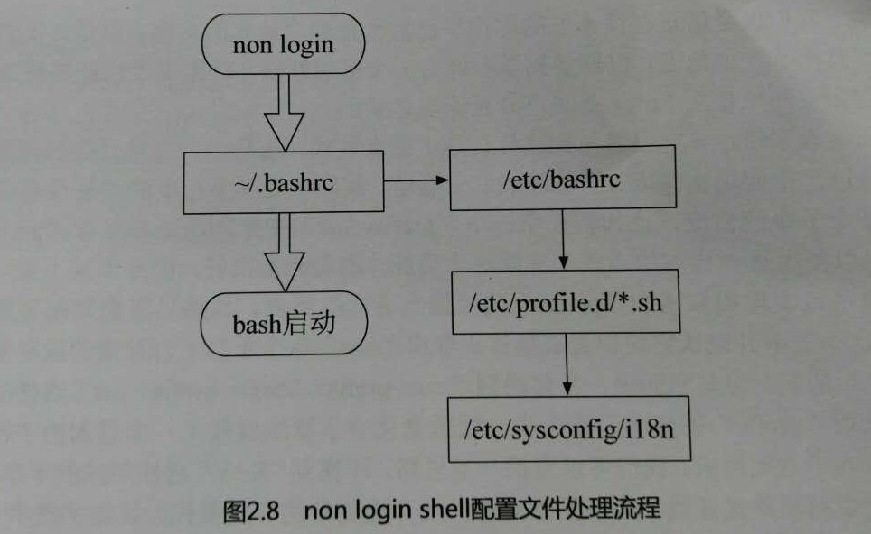

当我们打开shell的时候，会加载哪些配置文件呢？加载的顺序又是怎么样呢？录linux的shell其实分两种，login shell和non-login shell，那么login shell 和non-login shell有什么区别呢？
用户输入用户名密码shell才启动，这是login shell，还有一种non-login shell，不需要登录就可以获取bash页面，例如x-window环境下启动终端，不需要输入用户名密码，这是non-login shell。
## login shell读取配置文件流程
### 系统设置文件

只有login shell才读取系统设置文件/etc/profile，它是系统的整体的配置文件，该文件会调用  
    ①/etc/inputrc用来设置bash的热键，[Tab]是否有声音信息。  
    ②/etc/profile.d/*.sh，这个目录下的文件定了bash的操作界面、语系以及一些公共的命令别名。  
    ③/etc/sysconfig/i18n这个文件提供对/etc/profile.d/lang.sh调用，决定bash默认使用何种语系。  
### 用户的个性设置文件

1. 读取完系统设置文件，开始读取用户的个性设置文件。~目录下有三个隐藏文件~/.bash_profile,~/.bash_login,~/.profile.如果~/.bash_profile存在，则不理会其他两个，如果~/.bash_profile不存在则读取~/.bash_login，如果这两个都不存在则读取~/.profile，个性化配置文件主要是获取用户有关的环境、别名、函数。  
2. 然后如果~/.bashrc存在的话，~/.bash_profile会调用它，所以可以把一些环境设置写入到~/.bashrc中。~目录下还有.bash_history和.bash_logout分别记录了用户的bash命令历史和bash退出时系统为我做什么。
3. 然后如果/etc/profile存在的话，它会被~/.bashrc调用，这个文件也会被non-login shell读取，该文件的作用是  
    ①依据不同的UID给出umask值  
    ②依据不同的UID给出PSI变量  
    ③调用/etc/profile.d/*.sh的设置  
如图：

## non-login shell读取配置文件流程
1. 读取~/.bashrc文件，这个文件也会被non-login shell读取，该文件的作用是  
    ①依据不同的UID给出umask值  
    ②依据不同的UID给出PSI变量  
    ③调用/etc/profile.d/*.sh的设置

## 所以得到
个人需要的设置写在~/.bashrc文件中即可。由于/etc/profile与~/.bash_profile都是取得login shell的时候才会读取配置文件，所以修改这两个文件的设置后，需要重新登录，相应的配置才能生效，其他的配置可以通过source命令将配置文件的内容读入当前shell环境中。
