# python中super()的用法。  
python中的super()和java中的super()方法是不同的 ，当在python中使用super()的时候，尤其是之前是做java开发的，可能会认为这东西在python里怎么这么丑呢？看起来python里的``` super(cls,obj) ```和java里的``` super()``` 是一样的，但是当多继承存在的时候，事情可能就不对劲了。事实上在python里super()是一个类而不是一个方法。

#### 举例：  
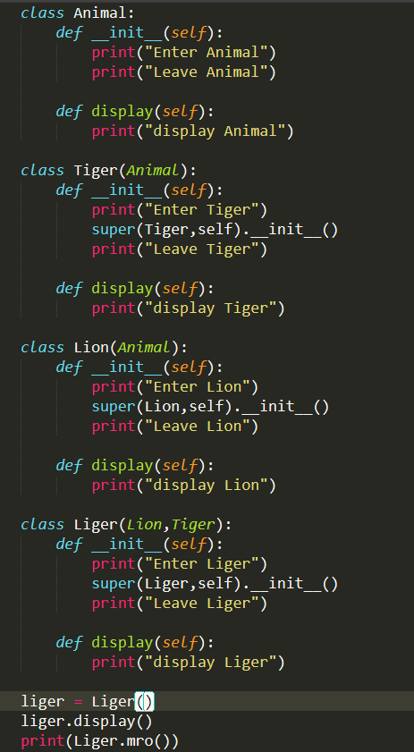  
然后  
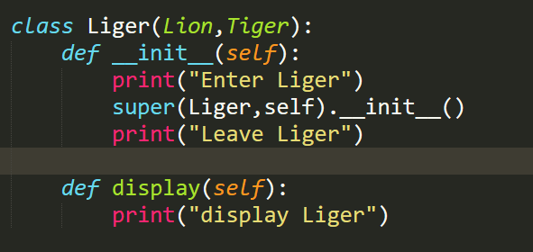  
输出  
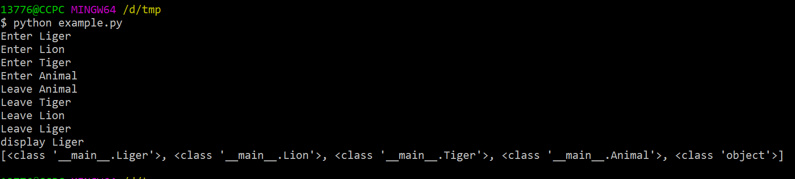  
看起来什么都没有发生，但是当我们改变第一个参数的时候  
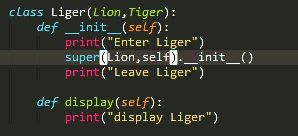  
输出  
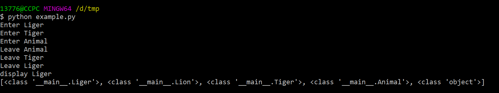  
看起来哪里不对  
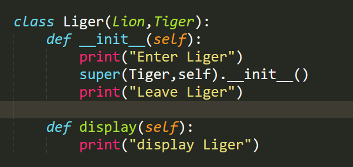  
输出  
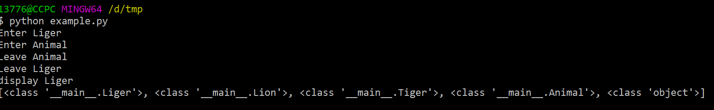  
继续  
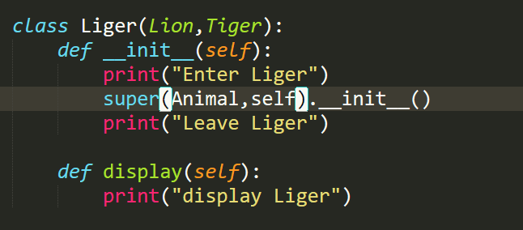  
输出  
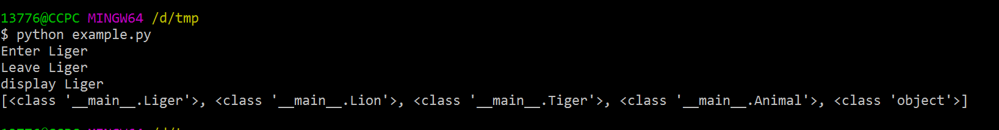
所以说，正如我们看到的，存在一个 Cls.mro().事实上，第二个参数决定了这个list，第一个参数决定了在这个list中的什么位置开始。  
最后  
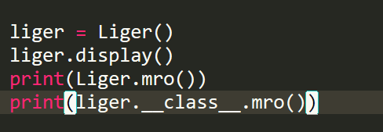  
输出  
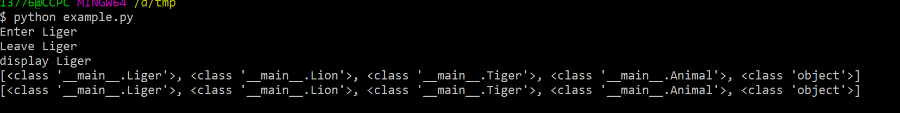
#### 所以说，super()的伪代码是这样的
```
def super(arg1,arg2):
    _list = arg2.__class__mro()
    return _list[index(arg1.__class__) + 1]
```