#  what is the super() means in python,and what is the difference between java and python
#     When using super() in python,especially for some developpers in JAVA,we think it is so ugly and useless.It seems same for super(cls,obj) in python and super() in java.But when we use multi-inherit,something occurs. In fact,super is a class in python.
## e.g input:
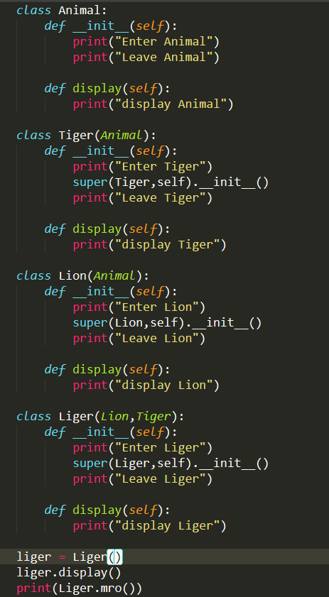
## take a good look at here
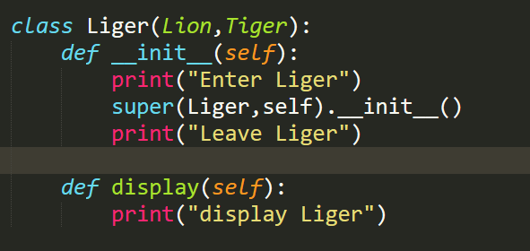
## So,the output
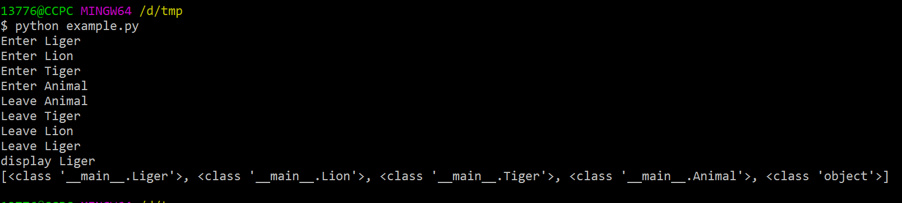
## seems nothing.But when we change the args0 in super().
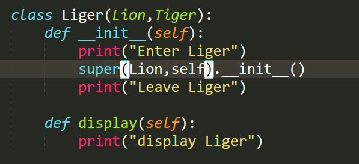
## output
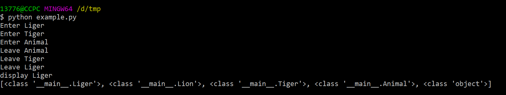
## Something seems diffrent.Go on
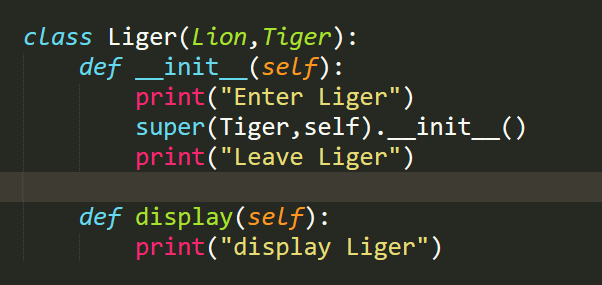
## output
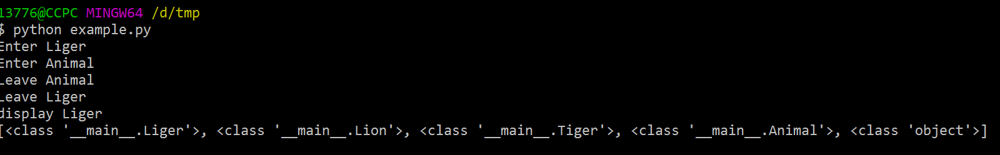
## go on
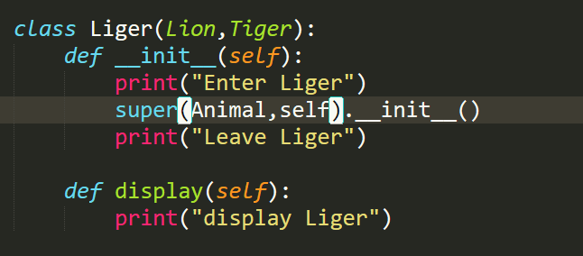
## output
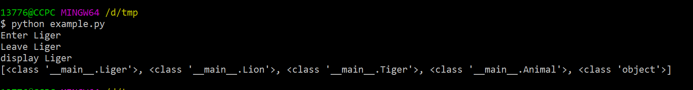
## As we can see,there is a list in Cls.mro().In fact,the args1 is the setting to the list and args0 to the order.
## the last one
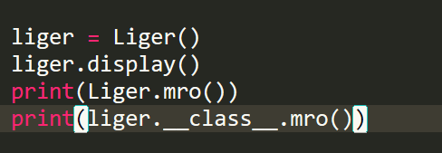
## output
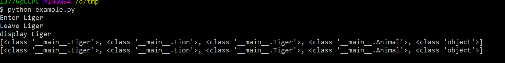
## So the super is like this
```
def super(arg1,arg2):
    _list = arg2.__class__mro()
    return _list[index(arg1.__class__) + 1]
```