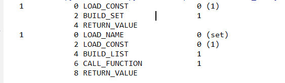

1. 映射类型的抽象基类是collections.abc模块中的Mapping和MutableMapping。
他们只是为dict和其他类型定义形式接口。但是不会像java一样，所有的类都继承它或者实现它。
实际使用的时候只需要继承dict或是collections.UserDict(更常用),它只起到了isinstance判定类型的时候的作用。
```python
from collections.abc import Mapping, MutableMapping

my_dict = {}
print(isinstance(my_dict, Mapping))
print(isinstance(my_dict, MutableMapping))
[Out]
True
True
```
1. 用setdefault可以优雅的处理找不到的键。比如统计单词出现频率
```python
index= {}
occurences = index.get(word,[])
occurences.append(location)
index[word] = occurrences
```
这三行代码可以简写为一行
```python
index = {}
index.setdefault(word,[]).append(location)
```
虽然两者结果是一样的，但是三行代码的那种至少要经过两次键查询，而一行代码的只需要一次键查询。
1. 处理上面的问题还有一种办法，使用collections.defaultdict,在实例化defaultdict的时候需要给构造
方法传递一个callable对象，这种callable对象会在__gititem__找不到键的时候调用。
```python
index = collections.defaultdict(list)
index[word].append(location)
```
defaultdict里的default_factory属性通过defaultdict的构造方法赋值，并且只有在__getitem__中被调用，在其他地方如get(k)时不发生作用，没有还是返回默认None。
1. 上面方法还可以通过集成dict，覆盖里面的__missing__方法来实现，__missing__方法在__getitem__找不到键的时候被调用。但是常用的不是继承dict而是继承collections.UserDict，
UserDict是用100%python实现了一遍dict，而dict使用了很多捷径导致我们必须重写很多方法。而且UserDict不是dict的子类，但是有一个属性data是dict的实例，data属性是UserDict数据最终存储的地方。
这样可以避免子类在实现__setitem__的时候产生不必要的递归，也可以让__contains__代码更简洁。
```python
import collections


class strKeyDict(collections.UserDict):
    def __missing__(self, key):
        if isinstance(key, str):
            raise KeyError
        # 如果不加判断当键不存在的时候会无限递归
        return self[str(key)]

    def __contains__(self, key):
        return str(key) in self.data

    def __setitem__(self, key, value):
        self.data[str(key)] = value
```
#### 字典的变种
1. collections.OrderedDict可以保证顺序的dict，有popitem方法，默认删除的是
最后一个元素可以通过关键字参数popitem(last=False)来删除第一个被添加进去的元素
1. collections.ChainMap可以通过构造函数传入多个不同的映射对象。从第一个开始查找找不到再找第二个。。
可以用作嵌套作用域的语言做解释器的时候用，可以用一个映射对象来代表一个作用域的上下文。
```python
import builtins
from collections import ChainMap

pylookup = ChainMap(locals(), globals(), vars(builtins))
```
1. collections.Counter会给键加一个计数器，每次更新键的时候都会增加这个计数器。可用作散列表对象计数或多重集合。most_comman(n)
返回最常见的n个键和他们的计数。
```python
import collections

ct1 = collections.Counter('fafdsfdfadfsdf')
print(ct1)
ct1.update('aaaaaa')
print(ct1)
print(ct1.most_common(2))
ct2 = collections.Counter(a=3, b=4)
print(ct2)
ct = ct1 + ct2
print(ct)
[Out]
Counter({'f': 6, 'd': 4, 'a': 2, 's': 2})
Counter({'a': 8, 'f': 6, 'd': 4, 's': 2})
[('a', 8), ('f', 6)]
Counter({'b': 4, 'a': 3})
Counter({'a': 11, 'f': 6, 'd': 4, 'b': 4, 's': 2})
```
1. 不可变映射类型虽然没有，但是types模块有一个MappingProxyType返回映射的一个只读视图，
但是他是动态的，所以原映射改了他也能看到，但是无法通过它直接修改。
```python
from types import MappingProxyType

d = {1: 'A'}
d_proxy = MappingProxyType(d)
print(d_proxy)
# [Out] {1: 'A'}
print(d_proxy[1])
# [Out] A
# d_proxy[2] = 'x'
# TypeError: 'mappingproxy' object does not support item assignment
d[2] = 'B'
print(d_proxy)
# [Out] {1: 'A', 2: 'B'}
print(d_proxy[2])
# B
```
1. 集合可以用&求交集，用|求并集，用-求差集，用^求对称差集。应该多用字面量.
```python
from dis import dis

dis('{1}')

dis('set([1])')
```

输出



也就是说用字面量直接调用BUILD_SET字节码,代替了3个操作：LOAD_NAME,BUILD_LIST,CALL_FUNCTION.
set的抽象形式接口定义在collections.abc.Set和collections.abc.MultipleSet中。
