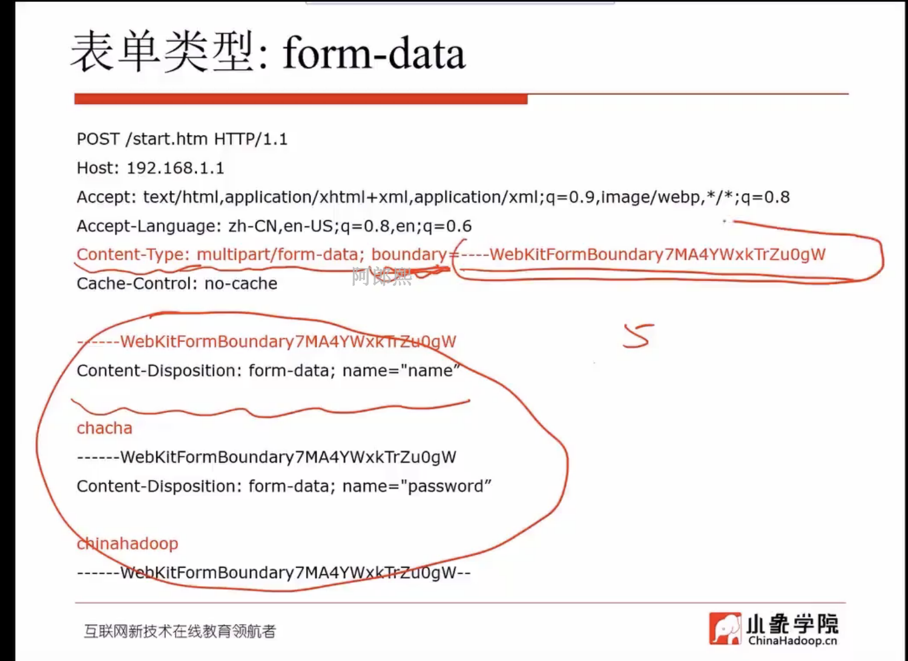

## linux根据名字杀进程
```bash
pgrep xxx | xargs kill
```
## phantomjs参数
* --ignore-ssl-errors=(true|false)
* --load-images=(true|false)
* --disk-cache=(true|false)
* --cookie-file = /disk/to/cookie.txt
* --debug = (true|false)
* --config = specified Json formatted config file.
* driver.set_window_size(1280,2400) 让网页变长一次都加载完不用再翻页去加载。

## js代码处理翻页
```javascript
window.scrollTo(0,document.body.scrollHeight)
```
## python urllib.urlencode 可以传一个dict 而生成url的参数格式
## 表单的类型分两种
1. form-data 它的header是Content-Type: multipart/form-data;boundary=----WebKitFormBoundaryxxxxxxx  这个boundary是post请求的body里面不同字段的分割线。
2. 