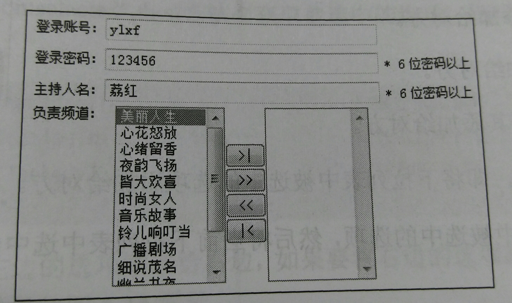

## 1.在js中获取velocity变量
要在vm文件的js中使用velocity的变量可以先var jq = jQuery.noConflict(); 讲$的控制权交出来之后jQuery的$用jq代替。velocity变量直接$
## 2.各种jQuery选择器
### （一）层次选择器：
$("body div")是body内的所有div  
$("body > div")是body内的子元素  
$(".one + div")是.one后面的一个div，相当于$(".one").next("div")  
$(".one ~ div")是.one后面的所有div，相当于$(".one").nextAll("div")  
$(".one~div")是.one后面的所有同辈div，$(".one").siblings("div")是.one的所有同辈div
### （二）过滤选择器：
#### ①基本过滤选择器
$("div:not(.one)")是div中所有不是.one的  
$(":header")是所有标题元素  
$(":animated")是当前执行动画的元素  
$(":focus")是当前获取焦点的元素。  
#### ②内容过滤选择器
$("div:contains('我')")是div中包含文本我的元素  
$("div:empty")是div中不包含子元素的（包括文本元素）的  
$("div:parent")是div中包含子元素的（包括文本元素）的  
$("div:has('.mini')")是class为mini的div元素
#### ③可见性过滤选择器
$("div:visible")是可见的div元素
$("div:hidden").show(3000)是样式display为none的和input   type="hidden"的和visibility:hidden"的元素 show是展示元素单位是毫秒  
#### ④属性过滤选择器
$("div[title]")是div中有title属性的元素  
$("div[title=test]")是div中title属性为test的元素,不为test的元素用!=,以test开头的元素，结尾用$=,包含用*=，
等于或者以test为前缀字符串以-连接用|=，用空格分隔的值中含有的用~=，复合元素写多个[]  
#### ⑤子元素过滤选择器
$("div:nth-child(even)")是每个div的索引值是偶数的元素  
nth-child(odd)奇数 :nth-child(2)索引值为2的，:nth_child(3n)索引值是3的倍数的:nth-child(3n+1)索引值是3n+1的。 

==:nth-child和eq()的区别::nth-child为每一个父元素匹配子元素。eq只匹配当前集合的一个元素。并且eq()索引从0开始，
:nth-child索引从1开始==

$("div:first-child")匹配div中的第一个子元素  
$("div:last-child")匹配div中的最后一个子元素
``` 
$("div:only-child") 
```
匹配div中唯一的子元素。如果div只有一个子元素才会被匹配
#### ⑥表单对象属性过滤选择器
$("form1 :enabled")是form1中所有可用元素,:disabled是所有不可用元素  
$("input:checked")是input中所有被选中的元素（包括单选框和复选框）

``` 
$("select option:selected"）
```
选取所有选中的元素（下拉列表）
### （三）表单选择器
:input 是选取所有的
``` 
<input>,<textarea>,<select>
```
和
```
<button>
```
元素  
:text 选取所有的单行文本框  
:password选取所有的密码框  
:radio选取所有的单选框  
:checkbox选取所有的多选框  
``` 
:submit
```
选取所有的提交按钮  
:image选取所有的图像按钮  
:reset选取所有的重置按钮  
:button选取所有的按钮  
:file选取所有的上传域  
:hidden 选取所有的不可见元素  

#### 选择器注意事项  

1.如果表达式中含有特殊字符# .  (  [,等  
如id="id#b" 获取这样的元素采用
```
$("#id\\#b")  
```
如id="id[1]" 获取这样的元素采用
```
$("#id\\[1\\]")
```
2.要注意空格
如$(".test :hidden")表示.test的hidden的后代元素，而$(".test:hidden")表示.test中hidden的元素，加空格是层次选择器中的
后代选择器 不加空格是过滤选择器中的可见性过滤选择器。
## 3.jQuery中的DOM操作
#### 节点操作
①：创建节点  
使用jQuery工厂函数即可
```
$("<p>你好</p>")  
```
②：插入节点  
append() 向每个匹配的元素内部追加内容  
appendTo()将所有匹配的内容追加到指定元素中，与append()相反  
prepend()向每个匹配的元素内部前置内容  
prependTo()将所有匹配的元素前置到指定的元素中，与prepend()相反  
after()向每个匹配的元素之后插入内容  
insertAfter()将所有匹配的内容插入到指定元素后面，与after()相反  
before()在每个匹配的内容之前插入内容  
insertBefore()将所有匹配的内容插入到指定元素前面，与before()相反  
③：删除节点  
remove()将匹配的元素删除（包括它的所有后代节点），并且会删除这些元素绑定的事件，可以加参数过滤节点，
返回值是此节点的引用，后面可以用appendTo()再添加进去。  
detach()方法，将匹配的元素删除（包括它的所有后代节点），不会删除这些元素绑定的事件。
empty()清空节点里的东西。如果没有后代节点则清空节点的内容。 
④：复制节点  
clone()方法复制节点不会复制绑定的事件，但可以传入参数true来使副本具有绑定的事件。
如复制的节点不具有再复制的功能，传入true可以再复制。  
⑤：替换节点
a.replaceWith(b);
将所有符合条件的a替换为b
a.replaceAll(b);
将a替换掉符合条件的a，与replaceWith相反
⑥：包裹节点
a.wrap(b)；将每一个符合条件的a被b包裹
a.wrapAll(b)；将所有符合条件的a被一个b包裹
a.wrapInner(b);将a的每一个子元素被b包裹
#### 属性操作
获取设置属性attr(),删除removeAttr()
样式操作：追加样式addClass(),删除样式removeClass(),切换样式toggleClass("another")如果有则增加没有则去掉。
判断是否有样式hasClass()就相当于is(".anthor")  
jQuery 1.6 中prop()用来获取匹配元素集中第一个元素的属性值，removeProp()用来删除
#### 设置和获取值
单选框多选框的val()返回值为一个数组，也可以用数组设置值
#### 遍历节点
children()方法返回所有子元素不包括孙元素。
###### parent();parents("ul");closet("ul")的区别：
parent()返回匹配元素的父元素（一个）  
parents("ul")返回匹配元素的祖先元素，即父元素父元素的父元素。。。。。. 
closet("ul")是逐层向上查找父元素，再查找父元素的父元素，返回第一个匹配的祖先元素。
#### CSS-DOM操作
$("p").css("color");获取值  
$("p").css("color","red");设置值  
$("p").css({"fontSize":"30px","backgroundColor":"#888888"});设置多个值  
可以写成"fontSize"也可以写成"font-size",可以写成"30px"也可以写成30，传数字默认为px,如改单位只能写成"30em"  
offset()用来获取元素在当前视窗中的相对偏移，其中返回的对象包含两个属性，top和left。  
var offset=$("p").offset();  
var left = offset.left();  
var top = offset.top():  
postion()方法获取相对于最近的一个position属性为relative()或者absolute()的祖父及诶单的相对偏移，也是有两个属性top 和left  
scrollTop()和scrollLeft()方法用来获取滚动条相对顶端和左边的距离，也可以设置。

### 案例:
因为title属性相应太慢，用jquery实现效果，代码如下：
``` 
$(function(){
    var x = 10;
    var y = 20;
    $("a.tooltip").mouseover(function(e){
        this.myTitle = this.title;
        this.title="";
        //创建div元素
        var tooltip = "<div id='tooltip'>this.myTitle</div>";
        $("body").append(tooltip);
        $("#tooltip").
            css({
                "top":(e.pageY + y) + "px",
                "left":(e.pageX + x) + "px"
            }).show("fast");
    }).mouseout(function(){
        this.title = this.myTitle;
        $("tooltip").remove();
    }).mousemove(function(e){
        $("#tooltip").css({
            "top":(e.pageY + y)+"px",
            "left":(e.pageX + x) + "px"
        });
    });
});

```
## 4.jQuery中的动画和事件
#### jQuery中的事件
①：加载DOM  
传统的window.onload方法会当页面所有元素都加载完成才会执行，jQuery中的$(document).ready()方法是当DOM就绪时就执行，
不需要等待图片下载完成。如果需要所有元素都加载完在进行可以用$(window).load()方法。  
传统的window.onload方法只能有一个生效，如果写多个只有最后一个生效，而jQuery的$(document).ready()方法可以写多个，效果是自动追加到上一个上面。
``` 
$(document).ready(function(){//编写代码  }); 
```
也可以写成
``` 
$(function(){}); 
```
而$(document)也可以简写为$(),当$()不带参数时默认参数是ducument.所有也可以写成
``` 
$().ready(function(){}); 
```
②：事件绑定
bind(type,[,data],fn);第二个参数是作为event.data传递给事件对象的数据对象
$().hover(function(){},funtion(){});相当于$().mouseenter(function(){}).mouseleave(function(){});  
toggle(fn1,fn2,fn3....)用来模拟连续点击事件，第一次点击时触发fn1,第二次触发第二个函数，第三次触发第三个函数。。。。
不加参数toggle()为切换show()和hide().
③：事件冒泡
如果body div span都绑定了click事件，则点击span会先触发span的再触发div的再触发body的，逐层向上触发成为事件冒泡。停止事件冒泡方法
``` 
$("span").bind("click",function(event){ // dosomething
event.stopPropagation();//阻止事件冒泡
}); 
```
比如提交按钮会有点击之后提交的默认行为，可以通过event.preventDefault()来阻止默认行为。也可以直接写return false;  
从body到div再到span成为事件捕获，jQuery不支持，要用只能用js，但并非所有浏览器都支持事件捕获  
event.target是事件出发的元素。event.relatedTarget相关元素。jQuery中的这个属性封装了IE的不标准。
event.pageX event.pageY获取页面的x，y坐标，封装了不同浏览器实现。  
event.which可以获得鼠标的左中右键或者键盘的按键。  
event.metaKey可以获取键盘中的ctrl键，封装了不同浏览器的实现。  
④：移除事件绑定  
ubind([type],[data]);如果没有参数会移除元素上的所有事件，如果提供了事件类型，会移除该类型的所有绑定事件。如果有提供了绑定时的处理函数，则
只移除这个特定时间的特定函数。  
可以
``` 
$().bind("click",myFun1=function(){})
.bind("click",myFun2=function(){});
```

移除时
``` 
$().unbind("click",myFun1); 
```
来移除。  
如果只想绑定触发一次立即移除，可以直接用one("click",fn)来写。  
delegate() 方法为指定的元素（属于被选元素的子元素）添加一个或多个事件处理程序，并规定当这些事件发生时运行的函数。
使用 delegate() 方法的事件处理程序适用于当前或未来的元素（比如由脚本创建的新元素）。
语法
``` 
$(selector).delegate(childSelector,event,data,function)  
```
自jQuery1.7开始on()替换了之前的bind(),delegate()和live(),off()替代了之前的unbind(),undelegate()和die().
⑤：模拟操作  
$().trigger("click")模拟click()事件，简写为click().  
触发自定义事件 $().bind("myClick",function(){})，使用$().trigger("myClick")  
传递数据使用数组传递，
``` 
$("#bn").bind("myClick",function(event,message1,message2){//获取数据
    $("#test").append("<p>"+message1 + message2+"</p>");
})
```
模拟执行
``` 
$("#bn").trigger("myClick",["我的自定义","事件"]);
```
如果只想触发事件，不想要事件的默认行为，可以用triggerHandler();
```
$("#bn").triggerHandler("focus");
```
会触发focus事件，而不会获得焦点  
⑥：其他用法  
一。 一次绑定多个事件：
``` 
$(function(){
    $("#bn").bind("mouseover mouseout",function(){
        $(this).toggleClass("over");
    });   
});
```
就相当于
``` 
$(function(){
    $("#bn").bind("mouseover",function(){
        $(this).toggleClass("over");
    }).bind("mouseout",function(){
        $(this).toggleClass("over");
    });
});
```
但上面的代码更简洁。符合jQuery的"write less,do more"的理念。  
二。 添加事件的命名空间，便于管理
``` 
$(function(){
    $("div").bind("click.plugin",function(){
        $("body").append("<p>click事件</p>");
    });
    $("div").bind("mouseover.plugin",function(){
        $("body").append("<p>mouseover事件</p>");
    });
    $("div").bind("dblclick",function(){
        $("body").append("<p>dblclick事件</p>");
    });
    $("button").click(function(){
        $("div").unbind(".plugin");
    });
});
```
最后的接触plugin命名空间的事件就相当于
``` 
$("div").unbind("click").unbind("mouseover");
```
如果在不同命名空间上绑定了相同的事件，比如绑定了click和click.plugin只想解除没有命名空间上的click，可以用unbind("click!");
如果想触发所有的click，则unbind("click");  
#### jQuery中的动画
一。show()和hide()  
调用hide()会有两个行为，首先记住display的值("block"，"inline"或除了none之外的其他值)，
然后再把display设为none，调用show()时会重新设置为hide记住的值。  
show()和hide()可加入参数"slow"(600),"fast"(200),"normal"(400),或者传入数字，单位是ms。  
如果不传入参数会立即显示或隐藏，如果传入速度，会把高度、宽度、不透明度同时过渡。  
二。fadeIn()和fadeOut()淡入和淡出  
同show和hide，但只改变透明度。  
三。slideUp()和slideDown()  
同上，但只改变高度。
四。animate()自定义动画  
animate(params,speed,callback);  
简单动画：$(this).animate({left:"500px"},300);  
累加累减动画：$(this).animate({left,"+=500px"},300);  
多重动画：$(this).animate({left:"500px",height,"200px},300);  
按顺序执行动画：$(this).animate({left:"500px",300},300).animate({height:"200px"},300);  
如改变css样式，如果在动画下面写由于动画是事件驱动的，会css先执行，确保动画完成之后执行方法是写在回调函数里面。
五。stop([clearQueue],[gotoEnd])停止元素的动画。  
两个参数都是boolean值，如果不设置参数。则停止当前动画。第一个参数表示清空未执行完的动画队列，第二个参数表示直接将正在执行的动画跳转到末状态。
比如
```
$("#panel").hover(function(){
    $(this).stop().animate({height:"150"},200);
},function(){
    $(this).stop().animate({height:"22",width:"60"},300);
});
```
就可以解决问题，但是如果遇到组合动画
```
$("#panel").hover(function(){
    $(this).stop().animate({height:"150"},200)  //如果此时光标触发了光标移出事件将执行下面的动画，而非光标移除中的动画
    .animate({width:"300"},300);
},function(){
    $(this).stop().animate({height:"22",width:"60"},300)
    .animate({width:"60"},300);
});
```
此时只用stop()只会停止执行正在执行的动画而继续执行下一个动画。使用stop(true)可以清除当前元素尚未执行的动画。
stop(false,true)会让当前动画停止执行直达末状态。如果使用stop(ture,true)会停止执行清空动画队列，直达**正在执行的动画**的末状态。
遗憾的是jQuery中没有直达未执行的动画队列末状态的方法。  
判断是否处于动画状态：$().is(":animated")  
六。延迟动画：在animate()方法后面加上delay(1000)  
七。其他动画方法  
toggle()方法切换显示和隐藏；slideToggle()方法用高度效果切换显示和隐藏。fadeTo()方法用透明度调整至指定的值如fadeTo(600,0.2)。
fadeToggle()方法用透明度调整可见性。
用animate()方法可以代替所有动画方法。  
如代替$("p").show(400)  
``` 
$("p").animate({height:"show",width:"show",opacity:"show"},400);
```
如代替$("p").fadeIn(400);
```
$("p").animate({opacity:"show"},400);
```
如代替$("p").slideDown(400);
```
$("p").animate({height:"show"},400);
```
如代替$("p").fadeTo(400,0.6);
```
$("p").animate({opacity:"0.6"},400);
```
## jQuery对表单、表格的操作及更多应用
#### 表单应用
单行文本框  
比如想为文本框focus时和blur时添加不同的css，可以用css伪类解决。
```
input:focus , textarea:focus{
    border:1px solid #f00;
    background:#fcc;
}
```
但是IE６不支持除了超链接元素的:hover之外的伪类，可以用jQuery来弥补不足
```
.focus{
    border:1px solid #f00;
    background:#fcc;
}
```
然后用jQuery添加事件
```
$(function(){
    $(":input").focus(function(){
        $(this).addClass("focus");
    }).blur(function(){
        $(this).removeClass("focus");
    });
});
```
多行文本框使用  
点击放大按钮时增加多行文本框高度，省略部分代码
```
$comment.animate({height : "+=50"},400);
```
滚动条应用  
```
if(!$comment.is(":animated")){
    $comment.animate({scrollTop : "+=50"},400);
}
```
下拉框的应用  
  
将左边的选项移动到右边  
```
$("#add").click(function(){
    $("#select1 option:selected").appendTo("#select2");
});
```
点击左边的全部移动到右边
```
$("#add").click(function(){
    $("#select1 option").appendTo("#select2");
});
```
双击被选中的选项移动
```
$("#select1".dblclick(function(){
    $("option:selected",this).appendTo($("#select2");
});
```
表单验证  
html代码省略
```
$("form:input").blur(function(){
    var $parent = $(this).parent();
    $parent.find(".formtips").remove();//删除以前的提醒元素
    //验证用户名
    var minUserNameLen = 6;
    if($(this).is("#username")){
        if(this.value=="" || this.value.length < minUserNameLen){
            var errorMsg = "请输入至少" + minUserNameLen + "位的用户名";
            $parent.append("<span class='formtips onError'>" + errorMsg+"</span>");
        }else{
            var okMsg = "输入正确";
            $parent.append("<span class='formtips onSuccess'>" + okMsg + "</span>");
        }
    }
    //验证邮箱
    var regex = /.+@.+\.[a-zA-Z]{2,4}$/
    if($(this).is("#email")){
        if(this.value="" || (this.value != "" && !regex.test(this.value))){
            var errorMsg = "请输入正确的Email地址";
            $parent.append("<span class='formtips onError'>" + errorMsg + "</span>");
        }else{
            var okMsg = "输入正确";
            $parent.append("<span class='formtips onSuccess'>" + okMsg + "</span>");
        }
    }
}).keyup(function(){
    $(this).triggerHandler("blur");
}).focus(function(){
    $(this).triggerHandler("blur");
});
$("#send").click(function(){
    $("form .required:input").trigger("blur");
    if($("form .onError").length){
        return false;
    }
    alert("注册成功，密码已发送到你的邮箱，请查收。");
});
```
#### 表格应用
普通隔行变色：
```
.even{background:#FFF38F;}
.odd{background:#FFFFEE;}
```
某一行变色:
```
$("tr:contains('王五')").addClass("selected");
```
单选行变色
```
$("tbody>tr").click(function(){
    $(this).addClass("selected")
    .siblings().removeClass("selected")
    .end()  //如果不用end，当前元素会是其他元素
    .find(":radio").attr("checked",true);
});
```
复选框控制表格行变色
```
$("tbody>tr").click(function(){
    if($(this).hasClass(".selected")){
        $(this).removeClass("selected")
        .find(":checkbox").attr("checked",false);
    }else{
        $(this).addClass(".selected")
        .find(":checkbox").attr("checked",true);
    }
});
```
理论上也可以用**三元运算符**，但是我感觉酱不清晰。
```
$("tbody>tr").click(function(){
    var hasSelected = $(this).hasClass("selected");
    $(this)[hasSelected?"removeClass":"addClass"]("selected")
    .find(":checkbox").attr("checked",!hasSelected);
}
```
#### 其他应用
点击按钮改变字体大小  
```
$("span").click(function(){
    var thisEle = $("#para").css("font-size");
    var textFontSize = parseInt(thisEle,10);
    var unit = thisEle.slice(-2);
    var cName = $(this).attr("class");
    if(cNmae == "bigger"){
        textFontSize += 2;
    }else{
        textFontSize -=2;
    };
    $("#para").css("font-size";textFontSize + unit);
});
```
选项卡
```
var $div_li = $("div.tab_menu ul li");
$div_li.click(function(){
    $(this).addClass("selected")
        .siblings().removeClass("selected");
    var index = $div_li.index(this);

    $(div.tab_box > div")
        .eq(index).show()
        .siblings().hide();
}).hover(function(){
    $(this).addClass("hover");
},function(){
    $(this).removeClass("hover");
});
```
网页换肤
```
//要引入jQuery.cookie.js"
$(function(){
    var $li = $("#skin li");
    $li.click(function(){
        switchSkin(this.id);
    });
    var cookie_skin = $.cookie("myCssSkin");
    if(cookie_skin){
        switchSkin(this.id);
    }
});
function switchSkin(skinName){
    $("#" + skinName).addClass("selected")
        .siblings().removeClass("selected");
    $("#cssfile").attr("href","css/" + skinName + ".css");
    $.cookie("myCssSkin",skinName,{path:"/",expires:10});
}
```
## jQuery与Ajax的应用
#### js中的ajax方法
```
if(window.ActiveObject){
    xmlHttpReg = new Active XObject("Microsoft.XMLHTTP");
}else if(window.XMLHttpRequest){
    xmlHttpReg = new XMLHttpRequest();
}
xmlHttpReg.open("GET","test.php",true);
xmlHttpReg.onreadystatuschange = RequestCallBack;//设置回调函数
xmlHttpReg.send(null);//因为使用get提交，所有可以使用null作为参数调用
function RequestCallBack(){
    if(xmllHttpReg.readyState == 4){
        if(xmlHttpReg.status == 200){
            document.getElementById("resText").innerHTML = xmlHttpReg.responseText;
        }
    }
}
```
#### jQuery中的Ajax
jQuery中的ajax方法有三层，最底层是$.ajax()方法，第二层是load();get();post()方法，第三层是$.getScript();和$.getJSON()方法。
##### load方法  
```
load(url,[,data][,callback])
```
url为请求的地址，data为传送至服务器的数据，callback无论成功还是失败都会被调用。相当于$.ajax()的complete回掉函数。  
url的格式为url selector，如
```
$("#resText").load("test.html .para"); //只加载test.html中class为para的元素
```
回掉参数,load()方法的回掉函数有三个参数，分别是请求返回的内容，请求状态和XmlHttpRequest对象。
```
$("#resText").load("test.html",function(responseText,textStatus,XMLHttpRequest){
    //responseText:请求返回的内容
    //textStatus; 请求状态：success  error  notmodified  timeout 4种
    //XMLHttpRequest; XML对象
});
```
##### get方法
$.get()和$.post()方法都是全局函数  
```
$.get(url,[,data][,callback][,type]);
```
get方法的返回值止呕返回状态是success时才会被调用,type是服务端返回内容的格式，包括xml,html,script,json,text和_default  
回掉函数有两个参数
```
function(data,textStatus){
    //data : 返回的内容，可以是xml文档，json文件，html片段等
    //textStatus :　请求状态：success error  notmodified timeout4种
}
```
几种不同的返回数据的格式  
HTML格式：优点工作量小，缺点可重用性小
``` 
$(function(){
    $("#send").click(function(){
        $.get("get1.php",{
            username:$("#username").val(),
            content:$("#content").val(),
        },function(data,dataStatus){
            $("resTest").html(data);//将返回的数据添加到页面上
        });
    });
});
```
XML格式：优点可重用性高，各种开放平台兼容性高，缺点费流量，解析操作速度慢
```
$(function(){
    $("#send").click(function(){
        $.get("get2.php",{
            username:$("#username").val(),
            content:$("#content").val(),
        },function(data,dataStatus){
            var username = $(data).find("comment").attr("username");
            var content = $(data).find("comment content").text();
            var txtHtml = "<div class='comment'><h6>" +
            username + ":</h6><p class='para'>" +
            content + "</p></div>";
            $("#resText").html(txtHtml);//将返回的数据添加到页面上
        });
    });
});
```
Json格式：优点可重用性高，兼容性强，简洁，省流量。
```
$(function(){
    $("#send").click(function(){
        $.get("get2.php",{
            username:$("#username").val(),
            content:$("#content").val(),
        },function(data,dataStatus){
            var username = data.username;
            var content = data.content;
            var txtHtml = "<div class='comment'><h6>" +
            username + ":</h6><p class='para'>" +
            content + "</p></div>";
            $("#resText").html(txtHtml);//将返回的数据添加到页面上
        },"json"); //第四个参数json代表期望返回的数据格式为json
    });
});
```
json格式要求返回的数据格式特别严格，比如{"username":"张三"}而不能是{username:张三}  
##### load()方法。  
``` 
$(function(){
    $("#send").click(function(){
        $.load("get1.php",{
            username:$("#username").val(),
            content:$("#content").val(),
        },function(data,dataStatus){
            $("resTest").append(data);//将返回的数据添加到页面上
        });
    });
});
```
与get方法用法一样。
##### $.getScript()方法和$.getJson()方法。
$.getScript()方法
```
$(function(){
    $("#send").click(function(){
        $.getScript("test.js");
    });
});
```
就相当于
```
$(document.createElement("script)).attr("src","test.js").appendTo("head");
```
或者
```
$("<script type='text/javascript' src='test.js' />").appendTo("head");
```
也可以使用回调函数，例如点击后载入jquery.color.js,成功后给元素绑定颜色变化动画。
```
$(function(){
    $.getScript("jquery.color.js",function(){
        $("#go").click(function(){
            $(;".block").animate({backgroundColor:"pink"},1000)
            .animate({"backgroundColor:"blue"},1000)
        });
    });
});
```
$.getJson()方法，大体与getScript方法相同
```
$(function(){
    $("#send").click(function(){
        $.getJson("test.json",function(data){
            $("resText").empty();
            var html = "";
            $.each(data,function(commentIndex,comment){
                html +="<div class='comment'><h6>"
                + comment['username'] + "</h6><p class='para'>"
                + comment["content"] + "</p></div";
            });
            $("#resText").html(html);
        });
    });
})
```
$.each()函数是jQuery的全局函数，不操作jQuery对象。而是以数组或者对象作为第一个参数，以一个回调函数作为
第二个参数。回调函数拥有两个参数：一个为队形的成员或者数组的索引，第二个为对应变量或者内容。  
我们还可以使用jsonp形式的回调函数来加载其他网站的数据。例如
```
$(function(){
    $("#send").click(function(){
        $.getJSON("http://api.flickr.com/services/feeds/photos_public.gne?tags=car&
        tagname=any&format=json&jsoncallback=?",
        function(data){
            $.each(data.items,function(i,item){
                $("").attr("src",item.media.m)
                .appendTo("#resText");
                if(i == 3){
                    return false;  // 只遍历前四张图片
                }
            });
        });
    });
});
```
##### $.ajax()方法
$.ajax(options)方法只有一个参数。以key/value形式存在，所有参数都是可选的。    
<table>
<tbody>
<tr>
<td width="90" valign="top">参数名</td>
<td width="83" valign="top">类型</td>
<td width="419" valign="top">描述</td>
</tr>
<tr>
<td width="90" valign="top"><strong>url </strong></td>
<td width="83" valign="top">String</td>
<td width="419" valign="top">(默认: 当前页地址) 发送请求的地址。</td>
</tr>
<tr>
<td width="90" valign="top"><strong>type</strong></td>
<td width="83" valign="top">String</td>
<td width="419" valign="top">(默认: "GET") 请求方式 ("POST" 或 "GET")， 默认为 "GET"。注意：其它 HTTP 请求方法，如 PUT 和 DELETE 也可以使用，但仅部分浏览器支持。</td>
</tr>
<tr>
<td width="90" valign="top"><strong>timeout</strong></td>
<td width="83" valign="top">Number</td>
<td width="419" valign="top">设置请求超时时间（毫秒）。此设置将覆盖全局设置。</td>
</tr>
<tr>
<td width="90" valign="top"><strong>async </strong></td>
<td width="83" valign="top">Boolean</td>
<td width="419" valign="top">(默认: true) 默认设置下，所有请求均为异步请求。如果需要发送同步请求，请将此选项设置为 false。注意，同步请求将锁住浏览器，用户其它操作必须等待请求完成才可以执行。</td>
</tr>
<tr>
<td width="90" valign="top"><strong>beforeSend </strong></td>
<td width="83" valign="top">Function</td>
<td width="419" valign="top">发送请求前可修改 XMLHttpRequest 对象的函数，如添加自定义 HTTP 头。XMLHttpRequest 对象是唯一的参数。<br />
<pre><span style="color: #0000ff;">function</span> (XMLHttpRequest) {
  <span style="color: #0000ff;">this</span>; <span style="color: #008000;">// the options for this ajax request</span>
}</pre>
</td>
</tr>
<tr>
<td width="90" valign="top"><strong>cache </strong></td>
<td width="83" valign="top">Boolean</td>
<td width="419" valign="top">(默认: true) jQuery 1.2 新功能，设置为 false 将不会从浏览器缓存中加载请求信息。</td>
</tr>
<tr>
<td width="90" valign="top"><strong>complete </strong></td>
<td width="83" valign="top">Function</td>
<td width="419" valign="top">请求完成后回调函数 (请求成功或失败时均调用)。参数： XMLHttpRequest 对象，成功信息字符串。<br />
<pre><span style="color: #0000ff;">function</span> (XMLHttpRequest, textStatus) {
  <span style="color: #0000ff;">this</span>; <span style="color: #008000;">// the options for this ajax request</span>
}</pre>
</td>
</tr>
<tr>
<td width="90" valign="top"><strong>contentType </strong></td>
<td width="83" valign="top">String</td>
<td width="419" valign="top">(默认: "application/x-www-form-urlencoded") 发送信息至服务器时内容编码类型。默认值适合大多数应用场合。</td>
</tr>
<tr>
<td width="90" valign="top"><strong>data </strong></td>
<td width="83" valign="top">Object,<br />String</td>
<td width="419" valign="top">发送到服务器的数据。将自动转换为请求字符串格式。GET 请求中将附加在 URL 后。查看 processData 选项说明以禁止此自动转换。必须为 Key/Value 格式。如果为数组，jQuery 将自动为不同值对应同一个名称。如 {foo:["bar1", "bar2"]} 转换为 '&amp;foo=bar1&amp;foo=bar2'。</td>
</tr>
<tr>
<td width="90" valign="top"><strong>dataType </strong></td>
<td width="83" valign="top">String</td>
<td width="419" valign="top">
<p>预期服务器返回的数据类型。如果不指定，jQuery 将自动根据 HTTP 包 MIME 信息返回 responseXML 或 responseText，并作为回调函数参数传递，可用值:
<p>"xml": 返回 XML 文档，可用 jQuery 处理。
<p>"html": 返回纯文本 HTML 信息；包含 script 元素。
<p>"script": 返回纯文本 JavaScript 代码。不会自动缓存结果。
<p>"json": 返回 JSON 数据 。
<p>"jsonp": <a href="http://bob.pythonmac.org/archives/2005/12/05/remote-json-jsonp/">JSONP</a> 格式。使用 <a href="http://bob.pythonmac.org/archives/2005/12/05/remote-json-jsonp/">JSONP</a> 形式调用函数时，如 "myurl?callback=?" jQuery 将自动替换 ? 为正确的函数名，以执行回调函数。</p>
</p>
</p>
</p>
</p>
</p>
</td>
</tr>
<tr>
<td width="90" valign="top"><strong>error </strong></td>
<td width="83" valign="top">Function</td>
<td width="419" valign="top">(默认: 自动判断 (xml 或 html)) 请求失败时将调用此方法。这个方法有三个参数：XMLHttpRequest 对象，错误信息，（可能）捕获的错误对象。<br />
<pre><span style="color: #0000ff;">function</span> (XMLHttpRequest, textStatus, errorThrown) {
  <span style="color: #008000;">// 通常情况下textStatus和errorThown只有其中一个有值 </span>
  <span style="color: #0000ff;">this</span>; <span style="color: #008000;">// the options for this ajax request</span>
}</pre>
</td>
</tr>
<tr>
<td width="90" valign="top"><strong>global </strong></td>
<td width="83" valign="top">Boolean</td>
<td width="419" valign="top">(默认: true) 是否触发全局 AJAX 事件。设置为 false 将不会触发全局 AJAX 事件，如 ajaxStart 或 ajaxStop 。可用于控制不同的Ajax事件</td>
</tr>
<tr>
<td width="90" valign="top"><strong>ifModified </strong></td>
<td width="83" valign="top">Boolean</td>
<td width="419" valign="top">(默认: false) 仅在服务器数据改变时获取新数据。使用 HTTP 包 Last-Modified 头信息判断。</td>
</tr>
<tr>
<td width="90" valign="top"><strong>processData </strong></td>
<td width="83" valign="top">Boolean</td>
<td width="419" valign="top">(默认: true) 默认情况下，发送的数据将被转换为对象(技术上讲并非字符串) 以配合默认内容类型 "application/x-www-form-urlencoded"。如果要发送 DOM 树信息或其它不希望转换的信息，请设置为 false。</td>
</tr>
<tr>
<td width="90" valign="top"><strong>success </strong></td>
<td width="83" valign="top">Function</td>
<td width="419" valign="top">请求成功后回调函数。这个方法有两个参数：服务器返回数据，返回状态<br />
<pre><span style="color: #0000ff;">function</span> (data, textStatus) {
  <span style="color: #008000;">// data could be xmlDoc, jsonObj, html, text, etc...</span>
  <span style="color: #0000ff;">this</span>; <span style="color: #008000;">// the options for this ajax request</span>
}</pre>
</td>
</tr>
</tbody>
</table>

#### 序列化元素
##### serialize()方法
会将DOM元素序列为字符串
$("#form").serialize()相当于
```
{
    username:$("#username").val(),
    content:$("#content").val(),
}
```
就相当于字符串格式
```
"username="+encodeURIComponent($("#username").val())
+"&content" + encodeURIComponent($("#content").val())
```
不但可以表单选取，选择器也可以
$(":checkbox,:radio").serialize()会将选中的单选框和复选框序列化。
##### serializeArray()方法。
不返回字符串，而是返回json数据。
##### $.param()方法，将数组或者对象按照key/value就行序列化。
```
var obj = {a:1,b:2,c:3};
var k = $.param(obj);
alert(k); // 输出a=1&b=2&c=3;
```
#### jQuery中的ajax全局事件
这些方法用于注册事件处理器，用来处理页面上的任何 Ajax 请求，当某些事件触发后，这些事件处理器被调用。如何 jQuery.ajaxSetup() 中的 global 属性被设置为 true （这也是默认设置），那么，每个 Ajax 请求都会触发全局事件。注意：全局事件绝对不会被跨域（cross-domain）脚本或 JSONP 请求触发，和 global 属性的设置毫无关系。
```
.ajaxComplete()
```
当Ajax请求完成后注册一个回调函数。这是一个 AjaxEvent。
```
.ajaxError()
```
Ajax请求出错时注册一个回调处理函数，这是一个 Ajax Event。
```
.ajaxSend()
```
在Ajax请求发送之前绑定一个要执行的函数，这是一个 Ajax Event.
```
.ajaxStart()
```
在AJAX 请求刚开始时执行一个处理函数。 这是一个 Ajax Event.
```
.ajaxStop()
```
在AJAX 请求完成时执行一个处理函数。 这是一个 Ajax Event。
```
.ajaxSuccess()
```
绑定一个函数当 Ajax 请求成功完成时执行。 这是一个Ajax Event.